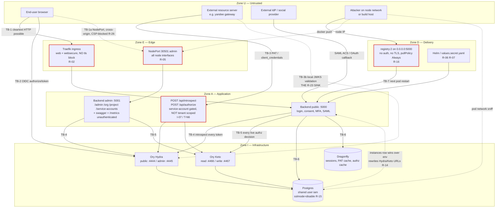

# Step 2 — Threat Model (STRIDE, attack trees, risk matrix)

**Target:** RediensIAM — multi-tenant OIDC identity provider
**Branch:** `security/audit-2026-07-28` · **Basis commit:** `ad3de8a` + the `client_id` addition to `POST /admin/hydra/clients`
**Method:** STRIDE per trust boundary, attack trees per high-value goal, likelihood × impact matrix
**Inputs:** [`01-vulnerability-scan.md`](01-vulnerability-scan.md) (R-01…R-32, I-01…I-11), [`../docs/2026-07-28-findings-securite-deploiement.md`](../docs/2026-07-28-findings-securite-deploiement.md) (A–E), [`../docs/INTEGRATION.md`](../docs/INTEGRATION.md), [`../docs/ARCHITECTURE.md`](../docs/ARCHITECTURE.md)
**Compliance in scope:** OWASP ASVS L2, CIS Kubernetes Benchmark, SOC 2 Type II, PCI-DSS, HIPAA

> **Reading rule.** Every threat in this document carries either an `R-nn`/`I-nn` reference back to
> step 1 or a `T-Nn` id for something step 1 did not name. `T-Nn` threats were derived by reading
> the code, not by re-reading the scan; each cites `file:line`. Where a STRIDE cell has no
> evidence-backed threat it says **none identified** — that is a finding too, and it is not padding.
>
> **Scope discipline.** R-01, R-04, R-11, R-13 and finding B are closed and verified. They appear
> here only where a *fix* creates a new interaction (see §7 ordering hazards). No threat is modelled
> against them.

---

## 1. What is actually at stake

RediensIAM is not an application that has an authorisation bug. It is the thing other applications
ask "who is this and what may they do". Three properties make its threat model different from a
normal web app, and every judgement below follows from them:

1. **It signs assertions that leave the blast radius.** A JWT minted here is validated by resource
   servers RediensIAM does not operate, cannot inventory, and cannot patch. A false claim inside a
   validly signed token is not a RediensIAM incident; it is an incident at every relying party
   simultaneously, and it stays true until each of them independently changes code.
2. **It is multi-tenant with tenant-supplied identifiers.** Tenants name their own roles
   (`src/Controllers/ProjectController.cs:341-353`). Those names travel into signed tokens
   (`src/Controllers/AuthController.cs:661-667`) and out through the introspection API
   (`src/Controllers/IntrospectionController.cs:64`). Anywhere a security decision is keyed on a
   string a tenant chose, cross-tenant escape is one naming collision away.
3. **It holds the root of a key hierarchy.** One HKDF root (`src/Config/AppConfig.cs:79-88`) derives
   the keys protecting every TOTP secret, every webhook signing secret, every per-org SMTP password
   and every social-provider client secret in the deployment. There is no per-tenant key separation
   and no automated re-enrolment path. Root-key compromise is not recoverable by rotation alone.

### Assets, ranked

| # | Asset | Where | Loss means |
|---|---|---|---|
| A-1 | Hydra token-signing key + system secret | Hydra token store; secret at `values.secret.yaml:19` (R-06) | Forge any token for any tenant; unrecoverable without a global signing-key rotation that logs out every user of every tenant at once |
| A-2 | HKDF root `encryptionKey` | env → `src/Config/AppConfig.cs:79-88` | Decrypt every TOTP secret, webhook secret, SMTP password, social client secret in the deployment |
| A-3 | The `ext.roles` claim's integrity | `src/Controllers/AuthController.cs:661-667` | Every downstream resource server's authorisation model is wrong (R-23) |
| A-4 | Keto tuple store | Keto + Postgres | The only live source of management authority (`src/Services/LiveAuthorizationService.cs:63-87`) |
| A-5 | `__system__` service accounts and their PATs | `src/Controllers/ServiceAccountController.cs`, `src/Services/PatService.cs` | Non-expiring, org-unscoped credentials on the most privileged accounts (R-22) |
| A-6 | User credential material (Argon2id hashes, TOTP secrets, backup codes, passkeys) | Postgres | Tenant-wide account takeover; PCI-DSS 8.x / HIPAA §164.312(d) |
| A-7 | Audit log | `audit_logs` table, `src/Services/AuditLogService.cs` | SOC 2 Type II evidence for the whole observation window; HIPAA §164.312(b) |
| A-8 | Runtime trust anchors (`Hydra:AdminUrl`, `Keto:ReadUrl`, `App:TrustedProxies`) | `instances` DB row, `src/Config/InstanceConfiguration.cs:114-149` | Complete auth bypass on next pod restart (R-14) |
| A-9 | Container image + its supply chain | `localhost:5000/rediensiam:{dev,prod}`, `Dockerfile` | Code execution as the IAM service (R-16) |

### Actors

| Actor | Starting position | Realistic goal |
|---|---|---|
| Anonymous internet | Can reach `:80`/`:443` on the public ingress | Credential capture, token capture, account takeover |
| Network-adjacent | Can route to a cluster node IP or sit on the pod network | NodePort admin surface (R-05), cleartext DB traffic (R-15), registry (R-16) |
| Authenticated end user of tenant T | Valid access token for `client_{projectId}` | Escalate within T; escape to another tenant |
| **`project_admin` of tenant T** | Lowest management tier | **Mint a token asserting `super_admin` (R-23)** — the flagship threat |
| `org_admin` of tenant T | Owns an organisation | Cross-tenant reach; destroy their own audit trail (T-N4) |
| Compromised external resource server | Holds a service-account PAT | Introspect any tenant's tokens; probe Keto (I-07 / T-N6) |
| Operator with cluster access | kubectl / Helm | — (assumed trusted; modelled for accident and for insider) |
| Build-host-adjacent attacker | TCP/5000 on the build host | Replace the running image (R-16) |
| Malicious/compromised npm or crate maintainer | Publishes a version | Build-time execution (`Dockerfile:7,15` — `npm ci` without `--ignore-scripts`) |

---

## 2. Trust boundary diagram



**Boundary inventory.** TB-1 browser ↔ SPA/backend `:5000` · TB-1a browser ↔ admin `:5001` via NodePort ·
TB-2 SPA ↔ Hydra · TB-3 external resource server ↔ `/api/introspect` · TB-3b external RS ↔ JWKS
(local validation, the boundary RediensIAM does not control) · TB-4 backend ↔ Hydra admin ·
TB-5 backend ↔ Keto · TB-6 backend ↔ Postgres/Dragonfly · TB-7 operator ↔ Helm/registry/cluster ·
TB-8 tenant ↔ tenant (logical, enforced only in application code — it has no network representation
at all, which is precisely why it is the weakest boundary in the system).

---

## 3. STRIDE per boundary

Ratings are **threat-level** judgements for this deployment, not a re-derivation of CVSS. Where they
diverge from step 1, §8 says why.

### TB-1 — Browser ↔ Login SPA ↔ Backend `:5000`

| | Threat | Evidence | Rating |
|---|---|---|---|
| **S** Spoofing | Credential capture and full session capture on the cleartext listener. `deploy/rediensiam/templates/ingress.yaml:8` sets `web,websecure` with no `tls:` block and no `redirectScheme`, so `POST /auth/login`, `/auth/register` and `/auth/password-reset/confirm` answer on port 80. HSTS cannot save a first contact — `src/Program.cs:382-383` emits it only when `ctx.Request.IsHttps` (**R-02**) | R-02 | **High** |
| | Login rate limiting reads only the per-IP counter (`src/Controllers/AuthController.cs:198`); the per-user counter written at `src/Services/LoginRateLimiter.cs:41-46` is never read on the login path. Credential stuffing across rotating source IPs is stopped only by the per-user DB lockout (**R-18**) | R-18 | Low |
| **T** Tampering | Request/response tampering on the cleartext path; `X-Forwarded-For` spoofing if `App:TrustedProxies` is ever widened, and that value lives in a mutable DB row (**R-14**, **T-N5**) | R-02, R-14 | Medium |
| | Tenant `custom_css` reaches a live `<style>` node with **no server-side validation on the org route** — `src/Controllers/OrgController.cs:162` calls `ApplyLoginTheme`, which never calls `ValidateLoginTheme`; the project route validates only `logo_url` (`src/Controllers/ProjectController.cs:167-175`). Injected into `frontend/login/src/pages/Login.tsx:127-131`. The only real filter is a client-side regex whose own header says it cannot be relied on alone (**R-09**) | R-09 | Medium |
| **R** Repudiation | **No audit record for any MFA mutation.** `src/Controllers/AccountController.cs` contains exactly one `audit.RecordAsync` call, at `:106` for password change. TOTP enable/overwrite (`:148`), backup-code regeneration (`:179`), phone-factor removal (`:260`), passkey removal (`:365`), social unlink (`:396`) and session revocation (`:213`, `:221`) write nothing (**T-N2**) | T-N2 | **High** |
| **I** Information disclosure | Access token written into the logout URL query string by the browser SDK — lands in browser history, `Referer`, Traefik and Hydra access logs (**R-29**) | R-29 | Medium |
| | `POST /org/smtp/test` returns `detail = ex.Message` (`src/Controllers/OrgController.cs:747-761`), a port-probe and banner oracle for anything the pod can reach (**R-10**) | R-10 | Medium |
| **D** Denial of service | Self-DoS only via the client-side route-matching advisory (GHSA-chx6-hx7r-mcp5). No attacker-controlled amplification identified on this boundary | R-03 | Low |
| **E** Elevation of privilege | **None identified on this boundary in isolation.** The session cookie is `CookieSecurePolicy.Always` (`src/Program.cs:54`), so the MFA challenge flow cannot complete over plain HTTP — fail-safe, and it genuinely holds. Elevation on this boundary requires chaining (see §7) |

### TB-1a — Browser ↔ Admin console `:5001` (NodePort 30501)

| | Threat | Evidence | Rating |
|---|---|---|---|
| **S** Spoofing | `cert-manager.io/cluster-issuer: selfsigned` (`deploy/rediensiam/templates/admin-ingress.yaml:11`) trains administrators to click through a certificate warning on the most privileged UI in the deployment. That habit is the spoofing vector, not the cert | R-05 | Medium |
| **T** Tampering | Production Hydra CORS permanently allowlists `http://localhost:30501` (`deploy/rediensiam/values.prod.yaml:36-40`). **Any** page served on that origin on **any** operator workstation is a trusted origin against production OAuth2 endpoints (**R-19**) | R-19 | Medium |
| **R** Repudiation | None identified beyond T-N2 |
| **I** Information disclosure | `type: NodePort` (`deploy/rediensiam/templates/service.yaml:21-28`) binds on **all** node interfaces. `/swagger` (`src/Program.cs:308-312`) and `/metrics` (`:348-349`) are unauthenticated on that port. The NetworkPolicy additionally admits the entire `default` namespace to 5000 and 5001 (`deploy/rediensiam/templates/network-policies.yaml:49-53`) while `deploy/deploy.sh:22` sets `NAMESPACE=default` — every pod in the release namespace reaches the admin port (**R-05**) | R-05 | Medium |
| **D** Denial of service | The admin console cannot log in at all today: server CSP (`src/Program.cs:389-391`) omits `connect-src`, falling back to `default-src 'self'`, which blocks the cross-origin discovery fetch (`frontend/admin/src/auth.ts:30-37`); and the intersected `style-src 'self'` blocks every inline style in a Radix/Tailwind UI (**R-26**) | R-26 | Functional |
| **E** Elevation of privilege | `src/Program.cs:334-338` runs `GatewayAuthMiddleware` on `/admin` only when an `Authorization` header is present or the verb is not GET. Safe **today** only because every `/admin` controller carries a class-level attribute. One new controller without it is an unauthenticated GET (**I-02**) | I-02 | Medium (latent) |

### TB-2 — SPA ↔ Hydra (OIDC authorize / token / end-session)

| | Threat | Evidence | Rating |
|---|---|---|---|
| **S** Spoofing | PKCE + `state` are implemented correctly (`sdk/typescript/rediensiam-web/src/index.ts:160-172`) and `redirectUri` is pinned to the app origin (`:110-118`). **The endpoints are not.** `#discover()` (`:281-292`) stores `authorization_endpoint`, `token_endpoint` and `end_session_endpoint` from the discovery document with no same-origin check, and `issuer` is never required to be `https:` (`:103`, `:284`). Given R-02 supplies a live cleartext path, an AiTM that rewrites discovery receives the PKCE `code_verifier` (`:174`) and the **refresh token** (`:306-314`) (**R-30** + **R-02**) | R-30, R-02 | **High as chained** |
| **T** Tampering | Discovery-document tampering, as above. The backend received exactly this fix as R-04 (`src/Services/SocialLoginService.cs:383-397`); none of the three SDKs did | R-30 | High |
| **R** Repudiation | None identified |
| **I** Information disclosure | `logout()` assigns `this.#accessToken` to a variable named `idToken` and puts it in the `id_token_hint` query parameter (`sdk/typescript/rediensiam-web/src/index.ts:208-225`). Functionally wrong *and* it writes to three persistent stores the SDK's own header (`:5`, `:88-91`) promises it never touches (**R-29**) | R-29 | Medium |
| | `iam.fetch()` attaches `Authorization: Bearer` to whatever URL the caller passes (`:235-243`), with no same-origin or allowlist check (**R-31**) | R-31 | Low |
| **D** Denial of service | None identified |
| **E** Elevation of privilege | `hasRole()` (`sdk/typescript/rediensiam-web/src/index.ts:275-277`) reads locally decoded, unverified claims. The docs say "render with them; never protect with them" (`docs/INTEGRATION.md:128-129`) — but the method's existence is the invitation, and R-23 makes the payload attacker-influenceable | R-23 | Medium |

### TB-3 — External resource server ↔ `/api/introspect`, `/api/authorize`

This boundary is the one finding B created, and it is materially better than what it replaced. It is
also the boundary where the remaining cross-tenant threats concentrate.

| | Threat | Evidence | Rating |
|---|---|---|---|
| **S** Spoofing | Caller identity is "is a service account". `IsServiceAccountCaller()` (`src/Controllers/IntrospectionController.cs:109-111`) accepts `Caller.IsServiceAccount` **or** any `ClientId` starting with `sa_`. Real SA clients are `sa_{guid}` (`src/Services/PatService.cs:201`), but `POST /admin/hydra/clients` now accepts a caller-chosen `client_id` whose allowlist (`src/Controllers/SystemAdminController.cs:862-864`) permits `_`, so `sa_backdoor` is registrable. SuperAdmin-only, and today no grant path yields a usable token for such a client — `GetConsent` rejects a client with no `project_id` metadata (`src/Controllers/AuthController.cs:655-659`) and the endpoint registers no JWK for `private_key_jwt`. **Latent, not currently exploitable** (**T-N1**) | T-N1 | Low (latent) |
| **T** Tampering | None identified. The endpoint mutates nothing |
| **R** Repudiation | Introspection and authorisation calls write no audit record — `src/Controllers/IntrospectionController.cs` has no `AuditLogService` dependency at all. A compromised RS PAT can enumerate tokens and probe Keto with zero trace | T-N6 | Medium |
| **I** Information disclosure | **No tenant scoping anywhere on this controller.** `IsServiceAccountCaller()` accepts any service account from any organisation, and `ResolveAsync` (`:93-107`) will resolve any token the deployment issued. So tenant A's gateway can introspect tenant B's user tokens and learn `sub`, `org_id`, `project_id` and the full role list. `Authorize` (`:76-88`) passes caller-supplied `Namespace`, `Object` and `Relation` straight to Keto — an unscoped one-bit oracle over the entire tuple store, including `System:rediensiam#super_admin` (**I-07**, promoted to **T-N6**) | I-07 / T-N6 | **Medium-High** |
| **D** Denial of service | No per-caller rate limit on `/api/introspect` or `/api/authorize`; each call costs a Hydra introspection and a Keto check. Amplification is bounded by the SA-gate, so this is a noisy-neighbour risk rather than an attack | — | Low |
| **E** Elevation of privilege | The management-role strip (`:53-56`) is **sound in the escalation direction** and I want to say so plainly: `GetManagementLevel()` picks the *highest* claimed level, so forging a higher role makes the live check *harder*, and a failure strips all three management names. Elevation via this path is not available. **But** the strip only knows three names (`IsManagementRole`, `:113-114`). Every other role string — including tenant-chosen names that a downstream RS treats as privileged — is echoed verbatim and unnamespaced (**T-N3**, see TB-8) | T-N3 | **High** |

### TB-3b — External resource server ↔ JWKS (local validation)

This boundary exists because finding B had no answer at the time; `docs/2026-07-28-findings-securite-deploiement.md:54` records the yandee gateway choosing local JWKS validation. It is a boundary
RediensIAM does not control and cannot instrument.

| | Threat | Evidence | Rating |
|---|---|---|---|
| **S** Spoofing | **R-23, end to end.** A `project_admin` creates a role literally named `super_admin` (`src/Controllers/ProjectController.cs:341-353`, `Name = body.Name`, no validation), assigns it, the user logs in normally, and Hydra signs a token whose `ext.roles` contains `super_admin` (`src/Controllers/AuthController.cs:661-667`). The signature is valid. The issuer is correct. The claim is a lie | **R-23** | **Critical** |
| **T** Tampering | None identified — the signature holds; that is the problem |
| **R** Repudiation | Role creation *is* audited (`src/Controllers/ProjectController.cs:350-351`), but the audit lands in RediensIAM, not at the relying party, and the relying party has no signal at all | R-23 | Medium |
| **I** Information disclosure | None identified |
| **D** Denial of service | None identified |
| **E** Elevation of privilege | `sdk/dotnet/RediensIAM.Client/ServiceCollectionExtensions.cs:109` maps every returned role onto `ClaimTypes.Role`, making `[Authorize(Roles = "super_admin")]` the natural consumer idiom. The Rust SDK's own doc-comment example is `info.has_role("super_admin")` (`sdk/rust/rediensiam-client/src/lib.rs:18`). The product ships the sink alongside the source | **R-23** | **Critical** |

### TB-4 — Backend ↔ Hydra admin API

| | Threat | Evidence | Rating |
|---|---|---|---|
| **S** Spoofing | `Hydra:AdminUrl` is emitted by the mutable `instances` row (`src/Config/InstanceConfiguration.cs:124`) and is where every bearer token is introspected (`src/Services/HydraService.cs:303`). Repointing it makes every token whatever the attacker's endpoint says (**R-14**) | R-14 | **High** |
| **T** Tampering | Same primitive. NetworkPolicy locks 4445 to the app pod (`deploy/rediensiam/templates/network-policies.yaml:22-26`), which is correct and holds — but it does not constrain *where the app is told to connect* | R-14 | High |
| **R** Repudiation | Hydra client creation and deletion are audited (`src/Controllers/SystemAdminController.cs:891`, `:910`). Adequate |
| **I** Information disclosure | Postgres traffic between Hydra and its DB is cleartext (`sslmode=disable`, `deploy/deploy.sh:126`), and Hydra's DB is the entire token store (**R-15**) | R-15 | Medium |
| **D** Denial of service | Hydra unavailability fails project creation closed with `502 hydra_unavailable` (`src/Controllers/OrgController.cs:119-126`) — correct | — | Low |
| **E** Elevation of privilege | The Hydra system secret is the literal string `CHANGE_ME_HYDRA_SYSTEM_SECRET_32CHARS` on the `--dev` path (`values.secret.yaml:19`), and nothing in `src/Program.cs:169-175` or `:371-373` checks it — those only check the all-zero TOTP placeholder (**R-06**) | R-06 | **High** |

### TB-5 — Backend ↔ Keto

| | Threat | Evidence | Rating |
|---|---|---|---|
| **S** Spoofing | `Keto:ReadUrl` is likewise in the mutable row (`src/Config/InstanceConfiguration.cs:126`). It is where every live management check resolves (`src/Services/LiveAuthorizationService.cs:68-83`) — i.e. the single control that stops R-23 from working against RediensIAM itself. Note carefully: `KetoService.CheckAsync` fails **closed** on a non-2xx (`src/Services/KetoService.cs:25`), which defeats a *denial* attack but not a *redirection* attack, because the attacker's endpoint answers `200 {"allowed": true}` (**R-14**) | R-14 | **High** |
| **T** Tampering | Role names become Keto relations: `AssignProjectRoleAsync` writes `Projects:{id}#role:{name}@user:{uid}` (`src/Services/KetoService.cs:137`). The `role:` prefix namespaces tenant strings away from the structural relations `manager`, `org_admin`, `super_admin` — **this is correct and it holds**; a role named `manager` produces `role:manager`, not `manager`. Tuples are written as JSON (`:30-37`), so there is no relation-string injection | — | None identified |
| **R** Repudiation | None identified |
| **I** Information disclosure | `/api/authorize` is an unscoped read path into this store (T-N6, TB-3) | T-N6 | Medium |
| **D** Denial of service | Keto unavailability denies every management request (fail-closed, `src/Services/LiveAuthorizationService.cs:50-56`). Correct trade-off, but it makes Keto a single point of availability failure for the entire admin surface | — | Low |
| **E** Elevation of privilege | The `ProjectAdmin` live check is `HasAnyRelationAsync(Projects, manager, subject)` — "manager of *some* project" (`src/Services/LiveAuthorizationService.cs:82`) — plus any `OrgRoles` row. Per-project scoping is left to each controller, which does it correctly today (`src/Controllers/ProjectController.cs:29-53`), so the live check contributes nothing at this level (**R-22 residual 3**) | R-22 | Medium (latent) |
| | The authz cache key is `authz:{userId}:{(int)level}` (`src/Services/LiveAuthorizationService.cs:41`), but the `OrgAdmin` decision at `:74-75` is a function of `claims.OrgId`, which is not in the key. Not exploitable today because `org_id` is minted server-side (`src/Controllers/AuthController.cs:631-641`); it becomes a cross-org bypass the moment any second path can vary it (**R-22 residual 2**) | R-22 | Medium (latent) |

### TB-6 — Backend ↔ Postgres / Dragonfly

| | Threat | Evidence | Rating |
|---|---|---|---|
| **S** Spoofing | `sslmode=disable` on the Hydra and Keto DSNs (`deploy/deploy.sh:126`, `:134`); the app's own connection string sets no SSL mode at all (`:118`) so Npgsql's `Prefer` default silently accepts cleartext. No server-certificate validation anywhere (**R-15**) | R-15 | Medium |
| **T** Tampering | **The `instances` row is the highest-value write target in the system.** `src/Program.cs:17` layers it over env/appsettings *last*, so it wins. App, Hydra and Keto share the Postgres user `iam` (`deploy/deploy.sh:118`, `:126`, `:134`), so a write primitive in **any one of the three** converts to full control of the trust anchors on the next pod restart. There is no signature, checksum or operator allowlist on the row (**R-14**) | R-14 | **High** |
| | **The scan understated this.** The emitted key list (`src/Config/InstanceConfiguration.cs:114-149`) is wider than the URLs and proxies it names. It also carries `Security:MaxLoginAttempts`, `Security:LockoutMinutes`, `Security:ArgonTimeCost`, `Security:ArgonMemoryCost`, `Security:ArgonParallelism`, `Cache:PatTtlMinutes` and `Audit:RetentionDays`. A DB write therefore also disables account lockout, weakens Argon2 for every future hash, extends the PAT introspection cache so revocation stops taking effect (`src/Services/PatService.cs:22`), and shortens audit retention so the retention sweep destroys the evidence (`src/Services/AuditLogRetentionService.cs:42-47`) (**T-N5**) | T-N5 | **High** |
| **R** Repudiation | Audit writes go through their own DbContext scope so a caller's uncommitted state cannot ride along (`src/Services/AuditLogService.cs:20-34`) — genuinely well done. Undermined only by T-N4/T-N5 deleting the result | — | Low |
| **I** Information disclosure | Password hashes, TOTP ciphertexts, PAT hashes, audit records and Hydra's entire token store cross the pod network in cleartext (**R-15**). The residual observer is CNI- or node-level, and `deploy/rediensiam/templates/network-policies.yaml:96-120` correctly restricts 5432 to {app, hydra, keto} | R-15 | Medium |
| **D** Denial of service | Single Postgres, single Dragonfly in the local-mode chart. Availability risk, not a security threat | — | Low |
| **E** Elevation of privilege | One shared `iam` user across three components with full DB rights. There is no least-privilege separation between the app's schema, Hydra's and Keto's — so a SQL primitive anywhere is a primitive everywhere. Named here because it is the precondition that makes R-14 practical, and step 1 recorded it as context rather than as a finding | R-14 | High |

### TB-7 — Operator ↔ Helm / cluster / image registry

| | Threat | Evidence | Rating |
|---|---|---|---|
| **S** Spoofing | `deploy/deploy.sh:85-88` runs `registry:2` with `-p 5000:5000` — all interfaces — no auth, no TLS, `REGISTRY_STORAGE_DELETE_ENABLED=true`. Both deploy branches set `pullPolicy=Always` against mutable tags (`:177`, `:186`). Anyone routable to the build host on TCP/5000 pushes a replacement `rediensiam:prod` and owns the next pod restart (**R-16**) | R-16 | **Critical** |
| **T** Tampering | No digest pinning, no signature verification. `Dockerfile:1-2` instructs "Pin base images to digests in production" and then pins nothing (`:4`, `:12`, `:20`, `:29`). `npm ci` runs without `--ignore-scripts` (`:7`, `:15`), so a compromised transitive executes at build time with the build host's privileges (**R-16**) | R-16 | **High** |
| **R** Repudiation | No provenance, no SBOM attestation, no admission control on image identity. A replaced image is indistinguishable from a legitimate one after the fact | R-16 | High |
| **I** Information disclosure | `values.secret.yaml` holds the HKDF root, the bootstrap super-admin, `changeme` and the Hydra system secret at mode `-rw-rw-r--` (**R-06**); `values.prod.secret.yaml` is generated with no `umask 077` and no `chmod 600` (`deploy/deploy.sh:110-135`) so it lands `-rw-r--r--` (**R-07**); `.sonar.env` holds three live `sqp_` tokens world-readable, two of them stale and never revoked (**R-08**) | R-06, R-07, R-08 | High / Medium / Medium |
| **D** Denial of service | The dev deploy crash-loops on empty `App__TrustedProxies` (`src/Program.cs:412-417` throwing inside the `ForwardedHeadersOptions` delegate evaluated at pipeline build). The fail-closed behaviour is correct and must stay; the defect is `values.dev.yaml` never supplying a value plus a false comment at `deploy/rediensiam/values.yaml:24-26` (**R-25**) | R-25 | Functional |
| **E** Elevation of privilege | No `seccompProfile` at pod or container level (`deploy/rediensiam/templates/deployment.yaml:22-29`) — CIS Kubernetes 5.7.2 and PSS *restricted*. Everything else in that block is correct (**R-32**) | R-32 | Low |

### TB-8 — Tenant ↔ Tenant

This boundary has **no network representation**. It exists only as application logic, and it is the
boundary a multi-tenant IdP is sold on.

| | Threat | Evidence | Rating |
|---|---|---|---|
| **S** Spoofing | **R-23.** A tenant's lowest management tier mints a signed assertion of platform-superadmin. Contained inside RediensIAM by two independent controls — the audience gate (`src/Middleware/GatewayAuthMiddleware.cs:44-52`, `:65-75`: a `client_{projectId}` token is neither in `ManagementClientIds` nor `sa_`-prefixed) and the live Keto check — **both of which genuinely hold**. Not contained anywhere else | **R-23** | **Critical** |
| | **T-N3 — cross-tenant role-name collision on the *recommended* path.** Introspection returns `Roles` as bare strings with no project or org qualifier (`src/Controllers/IntrospectionController.cs:64`), and the .NET SDK maps each onto `ClaimTypes.Role` (`sdk/dotnet/RediensIAM.Client/ServiceCollectionExtensions.cs:109`). Tenant A's role `admin` and tenant B's role `admin` are byte-identical in the resulting `ClaimsPrincipal`. The management-role strip does not help — it only knows three names (`:113-114`). A resource server serving two tenants and writing `[Authorize(Roles="admin")]` — the idiom the SDK teaches — has no tenant boundary at all unless it independently cross-checks `org_id`/`project_id`, which nothing in the SDK, the docs or the type system prompts it to do | **T-N3** | **High** |
| **T** Tampering | **T-N4 — tenant-controlled destruction of the audit trail.** `PATCH /org/settings` (`src/Controllers/OrgController.cs:58-70`) writes `AuditRetentionDays` with **no lower bound**: only `-1` is special-cased to "use the global default". Setting `0` makes the sweep's cutoff `UtcNow`; setting a negative value other than `-1` makes it a **future** cutoff, because `src/Services/AuditLogRetentionService.cs:43` computes `UtcNow.AddDays(-days)`. `ExecuteDeleteAsync` at `:44-46` then deletes **every** audit row for that org within 24 hours — including the `org.settings_updated` record of the change itself (`OrgController.cs:68`). An org admin can erase their own history on demand | **T-N4** | **High** |
| **R** Repudiation | T-N4 above; T-N2 for the per-user MFA path | T-N2, T-N4 | High |
| **I** Information disclosure | **T-N6.** Cross-tenant token introspection and an unscoped Keto probe oracle (TB-3). Tenant A's service account can determine whether an arbitrary token is live, whose it is and what roles it carries, and can ask one-bit questions about any relation in any namespace | T-N6 | Medium-High |
| | Tenant `custom_css` is served to every user of that project's login page and is not validated server-side (**R-09**) — within-tenant, but it is the page users type passwords into | R-09 | Medium |
| **D** Denial of service | Per-org SMTP is unvalidated (`src/Controllers/OrgController.cs:696-745`) and the NetworkPolicy egress exception list (`deploy/rediensiam/templates/network-policies.yaml:33-37`) omits `100.64.0.0/10` — the CGNAT range this deployment actually uses (`deploy/rediensiam/values.prod.yaml:6-7`). One tenant can reach the Tailscale mesh the webhook validator explicitly blocks (**R-10**) | R-10 | Medium |
| **E** Elevation of privilege | R-23 (above). Also `KetoService.AssignProjectRoleAsync`'s rank guard (`src/Services/KetoService.cs:117-127`) only fires when the actor holds `UserProjectRoles` rows in that project — `if (actorRoles.Count > 0)` — and a project admin granted via `OrgRoles` holds none, so rank is no obstacle to assigning the forged role | R-23 | **Critical** |
| | **R-22 residual 1.** `src/Controllers/ServiceAccountController.cs:18-24` declares only `[ApiController]` and `[Route]`. Every action gates on `Level => Claims.GetManagementLevel()` (`:28`) read straight from the token snapshot. No Keto or DB re-check anywhere on this path, including `POST /service-accounts/{id}/pat` (`:181-190`), which mints a credential that never expires unless `expires_at` is sent — and `expiresAt` binds to nothing (`docs/INTEGRATION.md:182-183`) | **R-22** | **High** |

---

## 4. Threats step 1 did not name

Six, all derived from source and each with a `file:line`. Two of them (T-N3, T-N4) I would place
above several of step 1's mediums.

| ID | Threat | Evidence | Proposed severity |
|---|---|---|---|
| **T-N2** | **No audit record on any MFA mutation.** `src/Controllers/AccountController.cs` has one `audit.RecordAsync` (`:106`, password change). TOTP setup/confirm (`:124`, `:148`), backup-code regeneration (`:179`), phone-factor deletion (`:260`), passkey deletion (`:365`), social unlink (`:396`), session revocation (`:213`, `:221`) all write nothing. R-24 is therefore not merely a takeover — it is a **silent** takeover | `AccountController.cs` | **High (7.0)** — SOC 2 CC7.2, HIPAA §164.312(b), PCI-DSS 10.2.1.5 |
| **T-N3** | **Role claims are unnamespaced across tenants.** `IntrospectionController.cs:64` returns bare strings; `ServiceCollectionExtensions.cs:109` maps each onto `ClaimTypes.Role`. The management-role strip covers three names (`:113-114`); every tenant-chosen name passes through un-scoped. Multi-tenant resource servers using the documented idiom have no tenant boundary. **This survives the fix for R-23** | `IntrospectionController.cs:64`, `ServiceCollectionExtensions.cs:109` | **High (7.4)** — ASVS 4.1.3, PCI-DSS 7.2.1 |
| **T-N4** | **Tenant-controlled audit destruction.** `OrgController.cs:58-70` accepts any `audit_retention_days` except `-1` with no floor; `AuditLogRetentionService.cs:43-46` turns `0` or any negative value into a cutoff at-or-after now and `ExecuteDeleteAsync`s the org's entire history within 24 h, self-erasing record included | `OrgController.cs:64-65`, `AuditLogRetentionService.cs:42-47` | **High (7.1)** — SOC 2 CC7.2, PCI-DSS 10.5.1, HIPAA §164.312(b) |
| **T-N5** | **R-14's blast radius is wider than recorded.** The mutable row also emits `Security:MaxLoginAttempts`, `Security:LockoutMinutes`, `Security:Argon{Time,Memory,Parallelism}Cost`, `Cache:PatTtlMinutes`, `Audit:RetentionDays` (`InstanceConfiguration.cs:114-149`) — i.e. disable lockout, weaken future password hashing, make PAT revocation ineffective, and purge the audit log, all from the same primitive | `InstanceConfiguration.cs:114-149` | Raises R-14 from 8.0 to **8.6** |
| **T-N6** | **`/api/introspect` and `/api/authorize` have no tenant scoping.** `IsServiceAccountCaller()` (`IntrospectionController.cs:109-111`) accepts any SA from any org; `ResolveAsync` resolves any token; `Authorize` (`:84-85`) forwards caller-supplied namespace/object/relation to Keto unmodified. Step 1 recorded this as **I-07 informational**; in a multi-tenant IdP it is a cross-tenant confidentiality boundary with no enforcement, and it is unaudited | `IntrospectionController.cs:76-88`, `:109-111` | **Medium (6.5)**, promoted from informational |
| **T-N1** | **`sa_` client-id prefix squatting.** `GatewayAuthMiddleware.cs:72` and `IntrospectionController.cs:111` both make a security decision on `ClientId.StartsWith("sa_")`. Real SA clients are `sa_{guid}` (`PatService.cs:201`), but `POST /admin/hydra/clients` now accepts a caller-chosen id whose allowlist permits `_` (`SystemAdminController.cs:862-864`). **Not exploitable today** — SuperAdmin-only, and no grant path yields a usable token for such a client (`AuthController.cs:655-659` rejects a client without project metadata; the endpoint registers no JWK). Recorded because it is the same class of defect as R-23: a security boundary keyed on an operator-influenceable string | `SystemAdminController.cs:862-888`, `GatewayAuthMiddleware.cs:72` | **Low (3.5)**, latent |

---

## 5. Attack trees

Notation: `AND` = all children required · `OR` = any child suffices · `[R-nn]` = enabling finding ·
`✗` = blocked today, with the control that blocks it.

### AT-1 — Cross-tenant privilege escalation

```
GOAL: act with another tenant's authority
├── OR-1  Forge a management role in an issued token                       [R-23]  ← PRIMARY
│   └── AND
│       ├── obtain project_admin in any tenant (self-serve, or invite)
│       ├── POST /project/roles {"name":"super_admin"}      ProjectController.cs:341-353
│       ├── assign it — rank guard inert for OrgRoles-granted admins  KetoService.cs:117-127
│       └── victim/attacker completes normal OIDC login → ext.roles  AuthController.cs:661-667
│           ├── against RediensIAM        ✗ audience gate GatewayAuthMiddleware.cs:44-52
│           │                             ✗ live Keto     LiveAuthorizationService.cs:68-69
│           ├── against /api/introspect   ✗ strip          IntrospectionController.cs:53-56
│           └── against an RS doing local JWKS validation  ✓ SUCCEEDS  → see AT-3
├── OR-2  Collide role names across tenants on the introspection path      [T-N3]  ← SURVIVES the R-23 fix
│   └── AND
│       ├── target RS serves ≥2 tenants and authorises on role name
│       ├── learn the RS's privileged role string (docs, JS bundle, guess "admin")
│       ├── create that role in the attacker's own project, assign to self
│       └── call the RS: [Authorize(Roles="admin")] matches   ServiceCollectionExtensions.cs:109
│           ✗ only if the RS independently checks org_id/project_id — nothing prompts it to
├── OR-3  Ride a stale management claim                                    [R-22]
│   └── AND
│       ├── hold a token minted while genuinely privileged
│       ├── grant revoked in Keto
│       └── target /service-accounts/* — no [RequireManagementLevel]  ServiceAccountController.cs:18-24
│           ✓ SUCCEEDS for the remaining token lifetime → chains into AT-4
├── OR-4  Cross-tenant read via the introspection surface                  [T-N6]
│   └── AND
│       ├── hold any service-account PAT in any org
│       └── POST /api/introspect with another tenant's token, or
│           POST /api/authorize {"namespace":"System","object":"rediensiam","relation":"super_admin"}
│           ✓ SUCCEEDS — read-only, unaudited, unscoped
└── OR-5  Rewrite the trust anchors                                        [R-14 + T-N5]
    └── AND
        ├── any write primitive against Postgres as user `iam`  (app OR hydra OR keto)
        ├── UPDATE instances SET keto_read_url = attacker      InstanceConfiguration.cs:126
        └── pod restart  → every live check answers "allowed"
            ✓ SUCCEEDS — fail-closed defends availability, not redirection  KetoService.cs:25
```

### AT-2 — Silent takeover of an account's MFA

```
GOAL: own the victim's second factor, durably and invisibly
└── AND
    ├── acquire one valid access token for the victim
    │   ├── OR  intercept on the cleartext ingress            [R-02]  ingress.yaml:8
    │   ├── OR  read it from Traefik/Hydra access logs, browser history
    │   │       or a Referer header — logout() puts it in the URL  [R-29]  index.ts:208-225
    │   ├── OR  AiTM the discovery document, take the refresh token [R-30+R-02] index.ts:281-292
    │   ├── OR  application passes a hostile URL to iam.fetch()   [R-31]  index.ts:235-243
    │   └── OR  FNV-1a preimage against a Rust-SDK cache key      [R-28]  lib.rs:251-262
    ├── POST /account/mfa/totp/setup       → new secret          AccountController.cs:124-146
    ├── POST /account/mfa/totp/confirm     → OVERWRITES user.TotpSecret with NO existence check
    │                                        and NO re-auth       AccountController.cs:148-177
    │   └── same call wipes and reissues all backup codes         AccountController.cs:170-174
    └── detection
        ├── audit log        ✗ NOTHING WRITTEN                    [T-N2]  AccountController.cs
        ├── user notice      ✗ no email/SMS on factor change (no NotificationService call)
        └── victim symptom   — their authenticator silently stops working; blamed on clock drift
POST-CONDITION: survives the victim's password reset. ChangePassword revokes Hydra sessions
(:111) but never touches TotpSecret. The attacker's factor outlives the remediation.
```

### AT-3 — Forge a management role a downstream resource server honours

```
GOAL: full admin at a relying party that trusts this issuer
└── AND
    ├── the RS validates locally against JWKS
    │   └── it does so because introspection did not exist when it integrated
    │       docs/2026-07-28-findings-securite-deploiement.md:54  ("on a choisi la validation JWKS locale")
    ├── the RS reads ext.roles for authorisation
    │   └── the SDKs teach exactly this: has_role("super_admin")   lib.rs:18
    │                                     ClaimTypes.Role mapping   ServiceCollectionExtensions.cs:109
    ├── mint the claim                                              [R-23]  ← AT-1 OR-1
    └── RediensIAM emits no signal
        ├── the token is validly signed by the real issuer — no anomaly to detect
        ├── the RS has no revocation channel it consults
        └── OR the same RS was already reachable via T-N3 without R-23 at all
MITIGATION IN PLACE: docs/INTEGRATION.md:148-156 warns integrators in writing. A documented
warning is a control with a human in the loop; it is not a technical control, and every RS that
integrated before that paragraph existed is unprotected and unenumerable.
```

### AT-4 — Harvest service-account credentials

```
GOAL: a non-expiring, org-unscoped credential on the deployment's most privileged accounts
└── OR
    ├── AND  (stale-claim path)                                    [R-22]
    │   ├── hold a token minted while super_admin
    │   ├── grant revoked in Keto — every other controller now 403s
    │   ├── POST /service-accounts/{id}/pat on a __system__ SA      ServiceAccountController.cs:181-190
    │   │   └── no filter on this controller → the token snapshot still rules
    │   └── omit expires_at (or send expiresAt, which binds to nothing) → token never expires
    ├── AND  (secrets-at-rest path)                                 [R-06 / R-07 / R-08]
    │   ├── local access to the build/ops workstation
    │   └── read values.secret.yaml (-rw-rw-r--), values.prod.secret.yaml (-rw-r--r--), .sonar.env
    ├── AND  (network path)                                         [R-15]
    │   ├── CNI- or node-level observation of the pod network
    │   └── PAT hashes + Hydra token store in cleartext on 5432
    └── AND  (registry path)                                        [R-16]  → AT-5
POST-CONDITION: a PAT is accepted by GatewayAuthMiddleware as management audience unconditionally
(GatewayAuthMiddleware.cs:67-68) and satisfies IsServiceAccountCaller for /api/introspect and
/api/authorize with no tenant scope (T-N6) — one credential, every tenant's tokens.
```

### AT-5 — Take over the deployment via the registry or the supply chain

```
GOAL: arbitrary code execution as the IAM service
└── OR
    ├── AND  (registry)                                            [R-16]
    │   ├── route to the build host on TCP/5000 — bound 0.0.0.0    deploy.sh:85-88
    │   ├── docker push localhost:5000/rediensiam:prod  — no auth, no TLS, delete enabled
    │   └── wait for a pod restart — pullPolicy: Always, mutable tag  deploy.sh:177,186
    │       ✗ nothing verifies a digest or a signature; no admission control
    ├── AND  (base image)                                          [R-16]
    │   ├── compromise node:20-alpine / dotnet:10.0 upstream tags
    │   └── next build pulls it — Dockerfile:1-2 says pin to digests; Dockerfile:4,12,20,29 do not
    └── AND  (build-time npm)                                      [R-21 context]
        ├── compromise any transitive of either SPA
        └── npm ci runs without --ignore-scripts  Dockerfile:7,15 → RCE on the build host
POST-CONDITION: read every secret mounted at deployment.yaml:76-114 — including the HKDF root
(A-2) and the Hydra system secret (A-1). From there: decrypt every TOTP secret and every stored
tenant secret, and forge tokens for every tenant. This is the only path in the model that reaches
BOTH root assets at once, which is why it ranks above its CVSS.
```

---

## 6. MITRE ATT&CK mapping

Only techniques that genuinely fit. Where the obvious candidate does not apply, that is said.

| Technique | ID | Threat / finding | Note |
|---|---|---|---|
| Exploit Public-Facing Application | T1190 | R-02, R-05 | Cleartext auth surface; NodePort admin surface |
| Adversary-in-the-Middle | T1557 | R-02 + R-30 | Discovery-document rewrite → PKCE verifier + refresh token |
| Network Sniffing | T1040 | R-02, R-15 | Cleartext ingress; `sslmode=disable` on the pod network |
| Valid Accounts: Cloud Accounts | T1078.004 | R-06, R-22 | Bootstrap super-admin `Admin1…`; stale-claim window |
| Steal Application Access Token | T1528 | R-29, R-31 | Token in logout URL; token attached to arbitrary URLs |
| Use Alternate Auth Material: Application Access Token | T1550.001 | R-28, R-22 | FNV-1a preimage; token-snapshot authorisation |
| Modify Authentication Process: MFA | T1556.006 | **R-24** | TOTP secret overwritten with no re-auth or existence check |
| Account Manipulation: Additional Cloud Roles | T1098.003 | **R-23** | The role is *created*, not forged — RediensIAM signs it legitimately |
| Account Manipulation: Additional Cloud Credentials | T1098.001 | R-22 (PAT), `POST /service-accounts/{id}/api-keys` | Non-expiring PAT; JWK registration on an SA |
| Create Account: Cloud Account | T1136.003 | T-N1 | `sa_`-prefixed client registration |
| Impair Defenses: Disable or Modify Cloud Logs | T1562.008 | **T-N4**, T-N5 | Audit retention set to 0/negative; `Audit:RetentionDays` via the instance row |
| Indicator Removal | T1070 | T-N2 | Not removal so much as never-written — the effect on an investigation is the same |
| Unsecured Credentials: Credentials in Files | T1552.001 | R-06, R-07, R-08 | `values.secret.yaml`, `values.prod.secret.yaml`, `.sonar.env` |
| Unsecured Credentials: Private Keys | T1552.004 | R-06 (A-2) | HKDF root key at rest |
| Implant Internal Image | T1525 | **R-16** | `docker push` to an unauthenticated registry |
| Supply Chain Compromise: Software Supply Chain | T1195.002 | R-16, `Dockerfile:7,15` | Unpinned base images; `npm ci` with lifecycle scripts enabled |
| Cloud Account Discovery | T1087.004 | T-N6 / I-07 | Cross-tenant introspection + unscoped Keto probe |
| Data from Information Repositories | T1213 | T-N6 | Enumerating tenant/role/subject metadata via introspection |
| Server Software Component: Web Shell | T1505.003 | — | **No fit.** No upload, no template rendering on a live path (`Handlebars.Net` is referenced but never invoked, I-01) |
| Forge Web Credentials: SAML Tokens | T1606.002 | — | **No fit for R-23.** The token is not forged; it is genuinely issued with a true-but-misleading claim. Mapping it here would misdirect detection engineering toward signature anomalies that will never appear |

---

## 7. Chains — where individually-medium findings become critical

The scan asked for this explicitly, and it is where the real risk lives.

### C-1 · The flagship: tenant role → signed lie → downstream admin
`R-23` + `TB-3b` (RS validating locally) + the SDK idiom (`ServiceCollectionExtensions.cs:109`,
`lib.rs:18`).
**Severity: individually 8.2 → jointly critical.** One tenant's *lowest* management tier obtains
platform-administrator authority at every relying party that reads `ext.roles` after a local JWKS
check. RediensIAM's own two controls hold, which is exactly what makes this dangerous: the product
looks safe from the inside while issuing a false assertion to the outside. Detection is impossible
at the relying party — the signature is valid and the issuer is correct.
**And the fix for R-23 does not close it.** `T-N3` reaches the same goal with a role named `admin`
instead of `super_admin`, on the *recommended* introspection path, because role names carry no
tenant qualifier. Both must be fixed: reserve the management names **and** namespace or scope the
role claim.

### C-2 · Token theft → permanent, invisible account ownership
`R-02` (or `R-29`, or `R-30`) → `R-24` → `T-N2`.
**Severity: 7.4 + 8.1 + 7.0 → critical.** R-02 supplies the token, R-24 converts a transient theft
into durable attacker-controlled ownership that survives the victim's password reset, and T-N2
means no record exists in the audit log that anything happened. The victim's only symptom is an
authenticator that "stopped working". For an IdP, this is the worst chain in the document by
*detectability*: R-16 is louder and bigger, but this one is quiet and per-account, which is what
survives an incident response.

### C-3 · Registry → code execution → both root secrets
`R-16` → secrets at `deployment.yaml:76-114` → `A-1` + `A-2`.
**Severity: 8.7 → catastrophic.** The only chain that reaches the Hydra system secret and the HKDF
root in a single step. Recovery requires rotating the signing key (logging out every user of every
tenant simultaneously), re-enrolling every TOTP factor, and rotating every webhook secret, SMTP
password and social client secret — none of which has an automated path in this codebase.

### C-4 · Any DB write → total auth bypass → blinded
`R-14` + `T-N5`, enabled by the shared `iam` Postgres user across app, Hydra and Keto
(`deploy/deploy.sh:118`, `:126`, `:134`).
**Severity: 8.0 → 8.6 with T-N5.** Repointing `Hydra:AdminUrl` makes every token whatever the
attacker says; repointing `Keto:ReadUrl` makes every live authorisation check answer yes. The
fail-closed design (`KetoService.cs:25`, `LiveAuthorizationService.cs:50-56`) defends against Keto
being *down*, not against Keto being *someone else* — a distinction worth naming because the code
comments read as though the control covers both. T-N5 adds: disable lockout, weaken Argon2 for
future hashes, extend the PAT cache so revocation stops working, purge the audit log.

### C-5 · Revoked admin → permanent system credential → cross-tenant oracle
`R-22` → non-expiring PAT on a `__system__` SA → `T-N6`.
**Severity: 6.5 + 6.5 → high.** The revocation gap is bounded by token lifetime; the credential it
mints is not bounded at all. That PAT then passes the management audience gate unconditionally
(`GatewayAuthMiddleware.cs:67-68`) and satisfies `IsServiceAccountCaller()` with no tenant scope —
so a *lapsed* administrator ends up with a permanent read oracle over every tenant's tokens. Note
the historical irony recorded in step 1: `ServiceAccountController` is the controller that
*terminated* the R-01 escalation chain, and it is the one left without the filter.

### C-6 · Ordering hazard: fixing R-26 activates R-09
`R-26` (CSP `style-src 'self'` at `src/Program.cs:392-393`) currently blocks the tenant `custom_css`
`<style>` node at `frontend/login/src/pages/Login.tsx:129-131`. **R-09 is mitigated today by a bug.**
Widening the CSP to make the theming feature work — which R-26's remediation requires — switches
R-09 on. **Fix R-09's server-side validation *before* or *with* R-26, never after.**

### C-7 · Ordering hazard: fixing R-26 increases R-05
Making the admin console usable on NodePort 30501 turns a currently-broken surface into a working
one on all node interfaces. Fix R-05 (`ClusterIP` + scoped NetworkPolicy + a real ingress) in the
same change, or the CSP fix is a net increase in exposure.

### C-8 · SDK endpoint trust + live cleartext ingress
`R-30` + `R-02`. Rated 4.2 and 7.4 individually; jointly it is full session theft with no user
interaction: rewrite discovery on the cleartext path, receive the PKCE `code_verifier`
(`index.ts:174`) and the refresh token (`:306-314`) at an attacker-controlled `token_endpoint`.
**I disagree with R-30's 4.2 for this reason** — see §8.

### C-9 · Operator-workstation origin trusted by production
`R-19` + `R-05`. `http://localhost:30501` is permanently allowlisted in production Hydra's CORS
(`values.prod.yaml:36-40`). Any page an attacker can get served on port 30501 of *any* operator's
machine is a trusted origin against production OAuth2 endpoints. Low likelihood, but it is a
production trust decision made for an SSH-tunnel convenience, and it never expires.

---

## 8. Prioritised risk matrix

**Likelihood** L1 remote · L2 unlikely · L3 possible · L4 likely · L5 near-certain given a motivated
attacker with the stated starting position.
**Impact** I1 negligible · I2 minor · I3 moderate · I4 major · I5 catastrophic *for an IAM product*
— i.e. measured across every tenant and every relying party, not just RediensIAM.

### Matrix

| | I5 catastrophic | I4 major | I3 moderate | I2 minor |
|---|---|---|---|---|
| **L5** | | **R-23**, **T-N2** | R-26, R-25 | |
| **L4** | **R-16** | **R-24**, **T-N3**, **T-N4**, R-22 | T-N6/I-07, R-05, R-09 | R-27, I-04, I-06 |
| **L3** | R-06¹ | R-02, R-29 | R-08, R-07, R-10, R-15, R-19 | R-17, R-18, R-31, R-32, I-08 |
| **L2** | R-14+T-N5 | R-30 (C-8: L4) | R-20, R-03 | I-01, I-03, I-05, I-09, I-10, I-11 |
| **L1** | | R-28 | T-N1, I-02 | R-21 |

¹ conditional on the `--dev` values path running on a routable host.

### Ranked table

| # | ID | Threat | L × I | Step-1 CVSS | My view | Boundary |
|---|---|---|---|---|---|---|
| 1 | **R-23** | Tenant role name → `super_admin` in a signed token | L5×I4 | 8.2 | **Agree; #1 by chain value** | TB-8 / TB-3b |
| 2 | **R-16** | Unauthenticated cleartext registry + `pullPolicy: Always` | L4×I5 | 8.7 | Agree | TB-7 |
| 3 | **R-24** | MFA factor takeover with a bearer token alone | L4×I4 | 8.1 | Agree; **effective severity higher** with T-N2 | TB-1 |
| 4 | **T-N2** | No audit record on any MFA mutation | L5×I4 | — | **NEW · 7.0** | TB-1 |
| 5 | **T-N3** | Role claims unnamespaced across tenants | L4×I4 | — | **NEW · 7.4 · survives the R-23 fix** | TB-8 / TB-3 |
| 6 | **T-N4** | Tenant can purge its own audit log | L4×I4 | — | **NEW · 7.1** | TB-8 |
| 7 | **R-22** | No live re-check on `ServiceAccountController`; unscoped cache key | L4×I4 | 6.5 | **Raise to 7.2** — the PAT it mints is unbounded | TB-8 |
| 8 | **R-14 + T-N5** | Mutable trust anchors, wider than recorded | L2×I5 | 8.0 | **Raise to 8.6** | TB-6 / TB-4 / TB-5 |
| 9 | **R-06** | Dev credentials incl. `CHANGE_ME…` Hydra system secret | L3×I5 | 8.9 | Agree, with the `--dev` caveat | TB-7 |
| 10 | **R-02** | Whole auth surface answers on cleartext HTTP | L3×I4 | 7.4 | Agree | TB-1 |
| 11 | **T-N6 / I-07** | Introspection + Keto oracle with no tenant scope | L4×I3 | informational | **Promote to 6.5** | TB-3 / TB-8 |
| 12 | **R-29** | Access token in the logout URL | L3×I4 | 5.9 | Agree | TB-2 |
| 13 | **R-30** | SDKs do not validate discovery endpoints or require HTTPS | L2×I4 (**L4 via C-8**) | 4.2 | **Raise to 6.8** — see below | TB-2 |
| 14 | **R-28** | Rust SDK authz cache keyed on 64-bit FNV-1a | L1×I4 | 7.4 | Agree on score; **remediate first** (one-line fix) | TB-3 |
| 15 | **R-05** | Admin port on NodePort + self-signed cert | L4×I3 | 6.4 | Agree; see C-7 | TB-1a / TB-7 |
| 16 | **R-09** | Tenant `custom_css` unvalidated server-side | L4×I3 | 5.4 | Agree; **masked by R-26 — see C-6** | TB-1 / TB-8 |
| 17 | **R-08** | Three live SonarQube tokens, world-readable | L3×I3 | 6.1 | Agree; two are stale and still unrevoked | TB-7 |
| 18 | **R-10** | Per-org SMTP unvalidated; Tailscale range reachable; probe oracle | L3×I3 | 5.5 | Agree | TB-8 |
| 19 | **R-15** | Postgres `sslmode=disable` | L3×I3 | 5.2 | Agree | TB-6 |
| 20 | **R-07** | Prod secrets file at default permissions | L3×I3 | 5.5 | Agree | TB-7 |
| 21 | **R-26** | Admin CSP blocks its own login and its fonts | L5×I3 | functional | Agree; **sequencing matters (C-6, C-7)** | TB-1a |
| 22 | **R-25** | Dev deploy crash-loops on empty `App__TrustedProxies` | L5×I3 | functional | Agree; keep the fail-closed throw | TB-7 |
| 23 | **R-19** | Prod CORS allowlists `http://localhost:30501` | L3×I3 | 3.1 | **Raise to 4.5** — see C-9 | TB-1a |
| 24 | **R-20** | SSRF re-validation is TOCTOU on DNS | L2×I3 | 3.7 | Agree | TB-8 |
| 25 | **R-31** | Browser SDK attaches the bearer to any caller URL | L3×I2 | 3.7 | Agree | TB-2 |
| 26 | **R-18** | Login rate limiting reads only the per-IP counter | L3×I2 | 3.7 | Agree — DB lockout genuinely mitigates | TB-1 |
| 27 | **R-32** | No `seccompProfile` on any pod | L3×I2 | 3.1 | Agree — CIS 5.7.2 | TB-7 |
| 28 | **R-17** | `AllowedHosts: "*"` | L3×I2 | 3.7 | Agree | TB-7 |
| 29 | **R-27** | Ingress has no base-path support | L4×I2 | functional | Agree | TB-7 |
| 30 | **R-03** | `react-router` 7.13.1 shipped | L2×I3 | 8.1 advisory | **Agree with the downgrade** — the sink analysis is sound | TB-1 |
| 31 | **T-N1** | `sa_` client-id prefix squatting | L1×I3 | — | **NEW · 3.5 · latent** | TB-3 |
| 32 | **I-02** | `/admin` GET without `Authorization` skips the middleware | L1×I3 | informational | Agree — one forgotten attribute away | TB-1a |
| 33 | I-01, I-03…I-11, R-21 | Remaining informational + dev-only advisories | L1–L2×I1–I2 | — | Agree | mixed |

### Where I disagree with step 1, and why

1. **R-14 → 8.6 (from 8.0).** Not a scoring quibble: the scan enumerated the URL and proxy keys but
   `src/Config/InstanceConfiguration.cs:114-149` also emits `Security:MaxLoginAttempts`,
   `Security:LockoutMinutes`, the three Argon2 cost parameters, `Cache:PatTtlMinutes` and
   `Audit:RetentionDays`. The same primitive that hijacks the trust anchors also disables lockout,
   weakens future password hashing, neutralises PAT revocation, and destroys the evidence. `PR:H` is
   also arguably generous given three components share one Postgres role.
2. **I-07 → a numbered medium (T-N6).** "Read-only and one bit per query" is true and is why it is
   not high. But this is a *multi-tenant* IdP, and the query crosses the only boundary the product
   sells. `IsServiceAccountCaller()` performs no org check whatsoever, and `ResolveAsync` will
   resolve any token the deployment ever issued. Informational is the wrong shelf.
3. **R-30 → 6.8 (from 4.2).** Rated in isolation as "each is a two-line guard". Rated against C-8 —
   R-02 is *live*, not hypothetical, and the scan says so itself — it is unauthenticated, no-user-
   interaction theft of the PKCE verifier and the refresh token via a rewritten discovery document.
   The `PR:H` in the scan's vector does not match an attacker who only needs a network position.
4. **R-22 → 7.2 (from 6.5).** The scan scores the revocation window. The window is bounded by token
   lifetime; the **PAT minted inside it is not bounded at all**, defaults to no expiry, and is
   accepted as management audience unconditionally thereafter.
5. **R-19 → 4.5 (from 3.1).** A permanently allowlisted cleartext localhost origin against
   *production* OAuth2 endpoints is a standing trust decision on every operator workstation, not a
   dev leftover.
6. **R-24 — score agreed, effective severity higher.** 8.1 assumes the takeover is discoverable.
   T-N2 shows it is not logged anywhere. For SOC 2 Type II and HIPAA, an undetectable control
   failure is worse than a detectable one of higher CVSS.
7. **R-28 — score agreed, remediation order disputed.** #6 on the scan's list. It is a one-line
   change (`sdk/dotnet/RediensIAM.Client/RediensIamClient.cs:139-143` is the template) that removes
   a complete authentication bypass. It should be done first purely on effort-to-benefit, whatever
   its likelihood.
8. **R-03 — agreed downgrade.** The navigation-sink analysis (all 32 `useNavigate()` sites, all 9
   `<Link>` uses) is the right way to reach that conclusion and I found nothing to contradict it.
9. **R-09 — agreed severity, disputed sequencing.** It is currently mitigated by R-26's bug. Any
   remediation plan that fixes R-26 first re-arms it (C-6).

---

## 9. Attack-scenario narratives

### S-1 — "The tenant that promoted itself" (R-23 → C-1)

Meridian Health signs up as a tenant. Their project lead is granted `project_admin` — deliberately
the lowest tier, deliberately scoped to one project. She calls
`POST /project/roles {"name":"super_admin","rank":1}`. The request is accepted verbatim
(`src/Controllers/ProjectController.cs:341-353`) and audited as a routine `role.created` in
Meridian's own log. She assigns it to a service user in the project's user list; the rank guard at
`src/Services/KetoService.cs:117-127` never fires because she holds no `UserProjectRoles` rows of
her own — her grant came through `OrgRoles`.

That user logs in through Meridian's own OIDC client. `GetConsent` reads the project's role names
straight out of the database and hands them to Hydra as session data
(`src/Controllers/AuthController.cs:661-677`). Hydra signs an access token whose `ext.roles` is
`["super_admin"]`. Everything about that token is genuine: correct issuer, valid signature, live
JWKS.

She points it at RediensIAM's own admin API and gets a 403 twice over — the audience gate sees
`client_{projectId}` and the live Keto check finds no `System:rediensiam#super_admin` tuple. Both
controls work exactly as designed.

She points it at the yandee gateway instead. The gateway validates locally against JWKS, because
that is what it chose when `/api/introspect` did not exist
(`docs/2026-07-28-findings-securite-deploiement.md:54`), and reads `ext.roles`. It grants platform
administration. There is no anomaly for anyone to detect: the signature is valid, the issuer is
right, the claim was really issued. RediensIAM's audit log records a role creation in one tenant.
The gateway's log records a successful admin action by a legitimately authenticated user.
**Neither log, read alone or together, describes what happened.**

### S-2 — "The authenticator that stopped working" (C-2)

An attacker on a café network watches a laptop reach `http://auth.rediens.net/auth/login` — port 80
answers, because the ingress declares `web,websecure` with no `tls:` block
(`deploy/rediensiam/templates/ingress.yaml:8`), and HSTS was never delivered on a first contact
(`src/Program.cs:382-383`). One access token.

They do not use it to read data. They call `POST /account/mfa/totp/setup`, receive an
`otpauth://` URL, scan it into their own phone, and call `POST /account/mfa/totp/confirm` with the
code it shows. `ConfirmTotp` never checks whether a TOTP factor already exists; it overwrites
`user.TotpSecret` outright (`src/Controllers/AccountController.cs:161-162`) and, in the same call,
deletes and reissues every backup code (`:170-174`). No current password. No current TOTP code. No
re-authentication of any kind.

Nothing is written to the audit log — `AccountController` audits password changes only (`:106`).
No notification is sent. The victim's authenticator now shows codes the server rejects; the
help-desk ticket says "my authenticator app broke". The prescribed fix — reset your password — runs
`ChangePassword`, which revokes Hydra sessions (`:111`) and **does not touch the TOTP secret**. The
attacker still owns the second factor. The account is now more secure against everyone except the
attacker, and RediensIAM has no record that the factor ever changed hands.

### S-3 — "One push" (AT-5 / C-3)

The build host runs `registry:2` on `0.0.0.0:5000` with no authentication and no TLS
(`deploy/deploy.sh:85-88`). An attacker who can route to it — a VPN peer, a co-located CI runner, a
compromised laptop on the same segment — pushes an image tagged `rediensiam:prod`. Nothing signs
it, nothing verifies a digest, no admission controller looks at it.

The next pod restart — a node drain, a Helm upgrade, an OOM kill — pulls it, because both deploy
branches set `pullPolicy=Always` against a mutable tag (`:177`, `:186`). The replacement process
runs as the IAM service with every secret from `deployment.yaml:76-114` in its environment: the
HKDF root that derives every TOTP, webhook, SMTP and social-provider key, and the Hydra system
secret. From that position the attacker can decrypt every stored tenant secret and mint tokens for
every tenant.

Recovery is the part worth planning for now, not then. Rotating the Hydra signing key invalidates
every access and refresh token in existence, so every tenant's users are logged out at the same
instant and every relying party's cached JWKS must refresh. Rotating the HKDF root requires
re-encrypting every TOTP secret — which cannot be done without the old key, so if the incident
response revokes it first, every MFA-enrolled user in every tenant must re-enrol by hand. **There
is no code path in this repository that performs either rotation.**

### S-4 — "The administrator who left" (C-5)

An administrator's `super_admin` grant is removed in Keto during offboarding. Every management
controller starts refusing them within 30 seconds — `RequireManagementLevelAttribute` re-checks
live and caches for `CacheTtlSeconds = 30` (`src/Services/LiveAuthorizationService.cs:27`). This is
the control that closed finding A and it works.

Their access token is still valid for its remaining lifetime, and `/service-accounts/*` carries no
such filter — `src/Controllers/ServiceAccountController.cs:18-24` declares only `[ApiController]`
and `[Route]`, and every action reads `Claims.GetManagementLevel()` from the token snapshot
(`:28`). They call `POST /service-accounts/{id}/pat` against a `__system__` service account
(`:181-190`) and omit `expires_at`. The PAT never expires.

That PAT outlives the token, the offboarding and the audit review. `GatewayAuthMiddleware` accepts
a PAT as management audience unconditionally (`:67-68`), and `IsServiceAccountCaller()` accepts it
for `/api/introspect` and `/api/authorize` with no tenant scope at all
(`src/Controllers/IntrospectionController.cs:109-111`). One credential, obtained in the minute
after revocation, becomes a permanent read oracle over every tenant's tokens and the entire Keto
tuple store — none of it audited, because `IntrospectionController` takes no `AuditLogService`
dependency.

### S-5 — "The tenant that deleted its history" (T-N4)

An org admin under investigation calls `PATCH /org/settings` with
`{"audit_retention_days": 0}`. There is no floor and no allowlist —
`src/Controllers/OrgController.cs:64-65` special-cases only `-1` ("reset to global default") and
stores anything else. Within 24 hours the retention background service computes
`cutoff = UtcNow.AddDays(-0)` and `ExecuteDeleteAsync`s every row where
`a.OrgId == org.Id && a.CreatedAt < cutoff` (`src/Services/AuditLogRetentionService.cs:42-47`) —
the organisation's entire history, including the `org.settings_updated` record of the change that
caused it (`OrgController.cs:68`). Sending `-5` instead makes the cutoff five days in the *future*,
which is tidier still.

For SOC 2 Type II this is not a failed control on one day; a Type II opinion covers an observation
period, and the evidence for that period is gone. For PCI-DSS 10.5.1 (one year retained, three
months immediately available) and HIPAA §164.312(b) it is a direct failure, and the tenant — not
the operator — holds the switch.

### S-6 — "The upgrade that broke the login page" (C-6, defender-side)

A remediation sprint fixes R-26 by widening the admin and login CSP so the console can complete its
discovery fetch and load its fonts. The change ships. Two days later a tenant reports their login
page rendering oddly for other tenants' users.

The CSP `style-src 'self'` at `src/Program.cs:392-393` had been blocking the tenant `custom_css`
`<style>` node at `frontend/login/src/pages/Login.tsx:129-131` — R-09 was mitigated by a bug. The
fix removed the mitigation without adding the server-side validation
`frontend/login/src/lib/sanitizeCss.ts` says in its own header is required. This scenario is in the
model deliberately: **it is the most likely way this codebase gets worse during hardening**, and it
is prevented by fixing R-09's server-side validation in the same change as R-26, not after it.

---

## 10. Business impact analysis

### Why an IAM breach does not scale like an application breach

For a normal SaaS product, impact is bounded by the data it holds. For an identity provider, impact
is bounded by **the number of systems that believe it** — and RediensIAM cannot enumerate that set.
`POST /admin/hydra/clients` mints clients for integrators who then deploy resource servers
RediensIAM never sees again, and `docs/INTEGRATION.md:230` documents no update path, no inventory
and no callback. When R-23 is exploited, the correct incident-response question is "which relying
parties read `ext.roles` after a local JWKS check?" and **there is no query that answers it.**

### Per-stakeholder consequences

| Stakeholder | Consequence of the top chains |
|---|---|
| **Every downstream tenant** | C-1: another tenant's project lead can act as platform administrator at any relying party they share. C-2: individual account takeover that survives password reset with no audit trail. T-N4: the tenant's *own* admin can destroy the tenant's forensic record |
| **Every relying party** | C-1/T-N3: the authorisation model is downstream of a string a stranger chose. Remediation requires a code change **at each RS**, coordinated, with no channel to reach them. C-8: session theft at the SDK layer with no server-side signal |
| **RediensIAM as operator** | C-3: the only viable recovery is a global signing-key rotation, which is a simultaneous forced logout for every user of every tenant, plus manual TOTP re-enrolment across the whole user base. No code path exists for either |
| **End users** | R-24 + T-N2: the second factor they were told protects them can be silently replaced by anyone holding one access token, and the standard remediation does not undo it |
| **Auditors** | T-N2 and T-N4 do not merely fail a control — they destroy or never create the evidence, which invalidates the *period* opinion a SOC 2 Type II report expresses |

### Regulatory weight, by threat

| Threat | Framework | Requirement | Why it bites |
|---|---|---|---|
| **R-23**, **T-N3** | PCI-DSS 7.2.1 · HIPAA §164.308(a)(4) · ASVS 4.1.3, 4.2.2 | Role-based access must be defined and enforced by need-to-know | Roles are defined by tenants and enforced by relying parties from an unvalidated string |
| **R-24** | PCI-DSS 8.4.2, 8.5.1 · HIPAA §164.312(d) · ASVS 2.1.10, 2.8.x | MFA must not be modifiable without re-verifying identity | Verbatim failure — `ConfirmTotp` requires nothing but a bearer token |
| **T-N2** | SOC 2 CC7.2 · HIPAA §164.312(b) · PCI-DSS 10.2.1.5 | Security-relevant events must be logged, specifically changes to authentication mechanisms | No record of any MFA change exists |
| **T-N4** | SOC 2 CC7.2 · PCI-DSS 10.5.1 · HIPAA §164.312(b) | Audit trail retention (PCI: 1 year, 3 months hot) and protection from modification | A tenant admin sets retention to zero and the trail is gone in 24 h |
| **R-02**, **R-15** | PCI-DSS 4.2.1 · HIPAA §164.312(e)(1), (e)(2)(ii) · ASVS 9.1, 9.2 | Strong cryptography during transmission of authentication data | Credentials and the whole token store cross the wire in cleartext |
| **R-06**, **R-07** | PCI-DSS 2.2.2, 8.3.x, 3.5.1 · HIPAA §164.312(a)(2)(i) | No vendor defaults; protect key material at rest | `CHANGE_ME…` Hydra secret; HKDF root world-readable |
| **R-22** | SOC 2 CC6.2, CC6.3 · HIPAA §164.308(a)(3)(ii)(C) | Access must be removed promptly on termination | One controller keeps honouring a revoked grant and mints an unbounded credential |
| **R-16** | SOC 2 CC8.1 | Change management: authorised, tested, approved changes only | Anyone routable to TCP/5000 changes production |
| **R-32**, **R-05** | CIS Kubernetes 5.7.2, 5.1.x | seccomp; limit network exposure | No `seccompProfile`; NodePort on all interfaces |
| **T-N6** | SOC 2 CC6.1 · HIPAA §164.308(a)(4) | Logical access restricted to authorised entities | No tenant scoping on the introspection surface |

### If asked "what is the single worst outcome"

**C-3.** R-16 is the only chain that reaches both A-1 (Hydra signing/system secret) and A-2 (HKDF
root) in one step, and the recovery from it is the one this codebase cannot perform. C-1 is more
likely and harder to detect, but it is recoverable by a validation guard plus a coordinated
notification; C-3 is not recoverable without a service-wide credential reset that has no
implementation.

---

## 11. Assumptions, and what would change this model

- **No running instance was exercised.** Every judgement is source-derived. R-23, R-24, R-22, T-N4
  and T-N6 are each a two-request confirmation and should be confirmed before remediation is
  scoped — the priority order in `01-vulnerability-scan.md` §"Attack surface map" still applies,
  and T-N4 should join it (`PATCH /org/settings {"audit_retention_days":0}`, then check the sweep).
- **Hydra and Keto subchart internals were not unpacked** (`deploy/rediensiam/charts/*.tgz`). Given
  how much of TB-2, TB-4 and TB-5 rests on Hydra's behaviour, this remains the largest blind spot,
  unchanged from step 1.
- **Runtime cluster state is unverified** — whether the CNI enforces NetworkPolicy at all, and
  whether a node firewall sits in front of NodePort 30501. Both materially change R-05 and R-16,
  and both would move R-16 between L4 and L2.
- **The relying-party population is unknown and unknowable from this repository.** C-1's impact is
  therefore a lower bound, not an estimate.
- **T-N1 is modelled as latent, not exploitable.** If a future change adds a JWK registration path
  to `POST /admin/hydra/clients`, or lets a non-project client complete consent, it becomes live —
  re-rate it then.
- **The rank guard, the audience gate, the live Keto check, the `role:` prefix on Keto relations,
  the fail-closed trusted-proxy throw, the PAT hashing, the audit service's own DbContext scope and
  the secure-cookie policy all hold under scrutiny.** They are load-bearing in this model, and
  several threats above are rated Medium instead of High only because of them. Any change that
  weakens one of them re-rates the threat it contains.

---

*Next step: 03 — mitigation design. Every threat above carries a finding ID or a `T-Nn`; that is the
join key back to `01-vulnerability-scan.md` and forward into remediation.*
