# RediensIAM Diagrams

Drawn against the code and the chart at `0.2.1` / `d4cfb31`, not against the design intent. Where a
control is implemented but switched off, or switched on but never executed outside dev, the diagram
says so on the diagram — a picture that shows an aspiration as fact is the failure mode
`.security-hardening/README.md` exists to warn about.

Prose companion: [`ARCHITECTURE.md`](ARCHITECTURE.md). Route table: [`API.md`](API.md). What is
still open: [`SECURITY.md`](SECURITY.md). Operator procedures: [`DEPLOYMENT.md`](DEPLOYMENT.md).

Legend used throughout:

| Marking | Meaning |
|---|---|
| `TLS` on an edge | encrypted **and** authenticated in both shipped environments |
| `TLS dev only` | the flag is set in `values.dev.yaml` and `values.prod.yaml`, and has only ever been executed on the dev cluster |
| `cleartext` | no transport encryption, by configuration |
| dashed edge | conditional, environment-dependent, or not currently exercised |
| `OFF` in a node | shipped, complete, and disabled by configuration |

---

## 1. Deployment topology

### 1.1 What talks to what, and over what

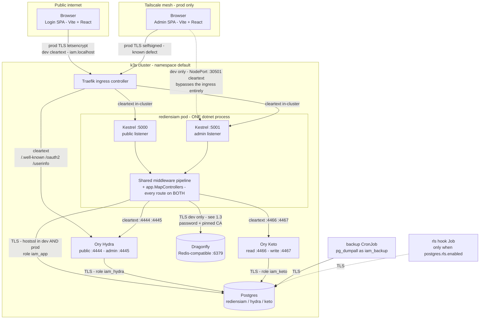
```mermaid
flowchart TB
    subgraph internet["Public internet"]
        browser["Browser<br/>Login SPA - Vite + React"]
    end
    subgraph mesh["Tailscale mesh - prod only"]
        adminbrowser["Browser<br/>Admin SPA - Vite + React"]
    end

    subgraph cluster["k3s cluster - namespace default"]
        traefik["Traefik ingress controller"]

        subgraph pod["rediensiam pod - ONE dotnet process"]
            p5000["Kestrel :5000<br/>public listener"]
            p5001["Kestrel :5001<br/>admin listener"]
            mvc["Shared middleware pipeline<br/>+ app.MapControllers - every route on BOTH"]
            p5000 --> mvc
            p5001 --> mvc
        end

        hydra["Ory Hydra<br/>public :4444 - admin :4445"]
        keto["Ory Keto<br/>read :4466 - write :4467"]
        pg[("Postgres<br/>rediensiam / hydra / keto")]
        df[("Dragonfly<br/>Redis-compatible :6379")]
    end

    browser -->|"prod TLS letsencrypt<br/>dev cleartext - iam.localhost"| traefik
    adminbrowser -->|"prod TLS selfsigned - known defect"| traefik
    adminbrowser -.->|"dev only - NodePort :30501 cleartext<br/>bypasses the ingress entirely"| p5001

    traefik -->|"cleartext in-cluster"| p5000
    traefik -->|"cleartext in-cluster"| p5001
    traefik -->|"cleartext<br/>/.well-known /oauth2 /userinfo"| hydra

    mvc -->|"cleartext :4444 :4445"| hydra
    mvc -->|"cleartext :4466 :4467"| keto
    mvc -->|"TLS - hostssl in dev AND prod<br/>role iam_app"| pg
    mvc -->|"TLS dev only - see 1.3<br/>password + pinned CA"| df

    hydra -->|"TLS - role iam_hydra"| pg
    keto -->|"TLS - role iam_keto"| pg

    backup["backup CronJob<br/>pg_dumpall as iam_backup"] -->|"TLS"| pg
    rlsjob["rls hook Job<br/>only when postgres.rls.enabled"] -.->|"TLS"| pg
```

Notes that belong beside this picture and not in a caption:

- **The port split is not a trust boundary.** `app.MapControllers()` maps every route on both
  listeners. Only the Swagger UI (`src/Program.cs:349`, gated on `Connection.LocalPort`) and the
  Prometheus scrape endpoint (`:395`, `RequireHost "*:{AdminPort}"`) are admin-port-only. The real
  separation is the hostname at the ingress — diagram 1.2.
- **Hydra `:4445` and Keto `:4467` have no authentication at all.** The NetworkPolicy is the entire
  control on both, and a NetworkPolicy is decorative unless the CNI enforces it.
- The dev NodePort edge is the one path that reaches `:5001` without passing Traefik. It renders
  only because `values.dev.yaml` sets `service.admin.type: NodePort`; prod is `ClusterIP`.

### 1.2 Ingress routing — where the hostname does the work

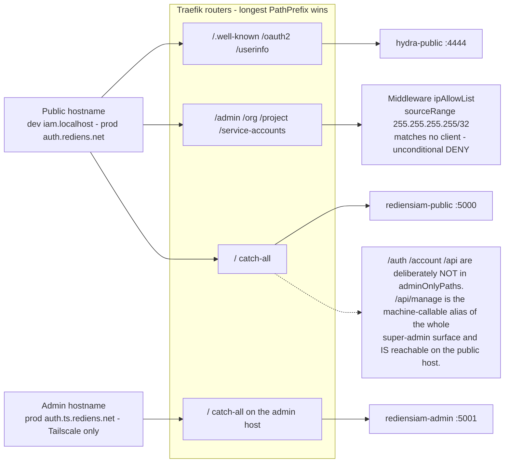
```mermaid
flowchart LR
    pub["Public hostname<br/>dev iam.localhost - prod auth.rediens.net"]
    adm["Admin hostname<br/>prod auth.ts.rediens.net - Tailscale only"]

    subgraph routers["Traefik routers - longest PathPrefix wins"]
        r1["/.well-known /oauth2 /userinfo"]
        r2["/admin /org /project /service-accounts"]
        r3["/ catch-all"]
        r4["/ catch-all on the admin host"]
    end

    deny["Middleware ipAllowList<br/>sourceRange 255.255.255.255/32<br/>matches no client - unconditional DENY"]

    pub --> r1 --> hydrasvc["hydra-public :4444"]
    pub --> r2 --> deny
    pub --> r3 --> pubsvc["rediensiam-public :5000"]
    adm --> r4 --> admsvc["rediensiam-admin :5001"]

    note["/auth /account /api are deliberately NOT in adminOnlyPaths.<br/>/api/manage is the machine-callable alias of the whole<br/>super-admin surface and IS reachable on the public host."]
    r3 -.-> note
```

`/admin`, `/org`, `/project` and `/service-accounts` are denied on the public hostname, so an
interactive console must come in over the admin ingress. `/api/manage/*` — the second `[Route]` on
`SystemAdminController`, `SystemHealthController` and `AdminWebhookController`, not a second
implementation — stays reachable on the public host, because a machine credential has no way to
reach the Tailscale-only admin ingress. Both aliases run the same action, the same audience gate and
the same live Keto re-check.

### 1.3 Transport and at-rest state, honestly

| | chart default `values.yaml` | `values.dev.yaml` | `values.prod.yaml` | Ever executed? |
|---|---|---|---|---|
| Public ingress TLS | off | **off** (`iam.localhost` cannot be certified) | **on**, `letsencrypt` | dev yes; in prod-profile scratch only with a self-signed issuer — **ACME has never been executed** |
| Admin ingress TLS | — (`ingress.admin.enabled: false`) | not used — NodePort instead | **on**, self-signed by the release's own `Issuer` | prod profile in scratch: ingress, cert and ClusterIP-only Service all worked; reachability is a Tailscale property, not a chart one |
| Postgres server TLS | off | **on** | **on** | dev, and once under the prod profile in a scratch namespace |
| Postgres `requireSsl` (`hostssl`) | off | **on** | **on** | dev, and once from scratch under the prod profile. **Never against an existing `pg_hba.conf`** |
| Dragonfly TLS | off | **on** | **on** | dev, and once from scratch under the prod profile. **The cutover on a live cache is still unobserved** |
| `postgres.rls.enabled` | off | **on** | **not overridden → off** | dev only |

Two things this table exists to keep straight:

1. **Dragonfly TLS is `true` in *both* values files.** It was dev-only when the cache-hardening
   work was written up; `values.prod.yaml` has since set it. It has now run in dev and once under
   the prod profile in a scratch namespace — never on a production cluster, and never as a
   *cutover* on a cache that was already up. It is a **hard cutover** — `--tls` makes Dragonfly
   refuse cleartext, so `cacheUrl` must gain `ssl=true` in the same `helm upgrade`.
   `templates/dragonfly.yaml:31-36` fails the render in **both** directions, so the pair cannot be
   split by accident.
2. **RLS is on in dev and off in prod**, not off everywhere. 19 tables carry a policy; see §6.

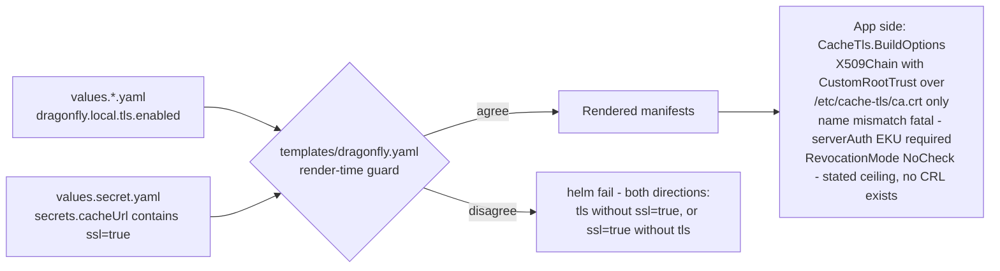
```mermaid
flowchart LR
    flag["values.*.yaml<br/>dragonfly.local.tls.enabled"]
    url["values.secret.yaml<br/>secrets.cacheUrl contains ssl=true"]
    render{"templates/dragonfly.yaml<br/>render-time guard"}
    ok["Rendered manifests"]
    fail["helm fail - both directions:<br/>tls without ssl=true, or ssl=true without tls"]

    flag --> render
    url --> render
    render -->|"agree"| ok
    render -->|"disagree"| fail
    ok --> pinned["App side: CacheTls.BuildOptions<br/>X509Chain with CustomRootTrust over<br/>/etc/cache-tls/ca.crt only<br/>name mismatch fatal - serverAuth EKU required<br/>RevocationMode NoCheck - stated ceiling, no CRL exists"]
```

### 1.4 What the NetworkPolicies actually permit

Five policies plus a baseline default-deny (`networkPolicy.defaultDenyScope: namespace`). Egress is
denied by default only for pods carrying an explicit `Egress` policy — which is all four workloads.

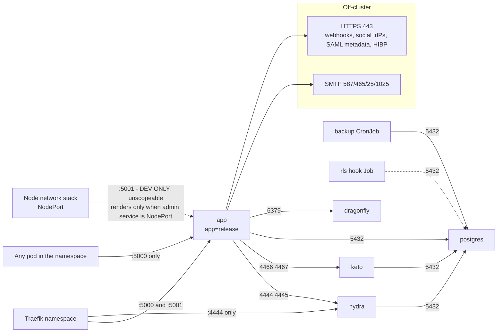
```mermaid
flowchart LR
    subgraph ext["Off-cluster"]
        smtp["SMTP 587/465/25/1025"]
        https["HTTPS 443<br/>webhooks, social IdPs, SAML metadata, HIBP"]
    end
    ingctl["Traefik namespace"]
    cotenant["Any pod in the namespace"]
    node["Node network stack<br/>NodePort"]

    app["app<br/>app=release"]
    hydra["hydra"]
    keto["keto"]
    pg["postgres"]
    df["dragonfly"]
    backup["backup CronJob"]
    rls["rls hook Job"]

    ingctl -->|":5000 and :5001"| app
    cotenant -->|":5000 only"| app
    node -.->|":5001 - DEV ONLY, unscopeable<br/>renders only when admin service is NodePort"| app

    app -->|"4444 4445"| hydra
    app -->|"4466 4467"| keto
    app -->|"5432"| pg
    app -->|"6379"| df
    app --> smtp
    app --> https

    ingctl -->|":4444 only"| hydra
    hydra -->|"5432"| pg
    keto -->|"5432"| pg
    backup -->|"5432"| pg
    rls -.->|"5432"| pg
```

Refused by these policies, and worth naming because each was a real finding:

- Nothing but the app pod reaches Hydra `:4445` or Keto `:4467`.
- Nothing but the app pod reaches Dragonfly `:6379`.
- Postgres originates **nothing** but DNS — a write primitive inside the database has no outbound
  channel.
- The app's `443` and SMTP egress carries an `except:` list of `networkPolicy.privateRanges`
  (RFC1918 + CGNAT `100.64.0.0/10`). This is the network-layer half of the SSRF control; the
  application half is `WebhookUrlValidator.CreateSsrfSafeHandler`, which pins the resolved address
  in a `ConnectCallback`.
- Co-tenant pods reach `:5000` and **not** `:5001`. The previous version of this rule granted both.

⚠ Every arrow above is a *permission*, not an enforcement. If the CNI does not implement
NetworkPolicy, all five policies are inert and Hydra's admin API is open to the whole cluster.

---

## 2. Request pipeline

The pipeline is **identical on both listeners** apart from two endpoints. Drawing it per-listener
would imply a boundary that does not exist.

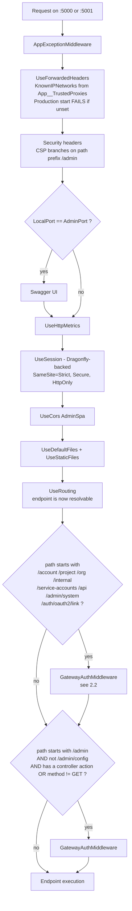
```mermaid
flowchart TD
    req["Request on :5000 or :5001"]
    exc["AppExceptionMiddleware"]
    fwd["UseForwardedHeaders<br/>KnownIPNetworks from App__TrustedProxies<br/>Production start FAILS if unset"]
    hdr["Security headers<br/>CSP branches on path prefix /admin"]
    swag{"LocalPort == AdminPort ?"}
    swagui["Swagger UI"]
    met["UseHttpMetrics"]
    sess["UseSession - Dragonfly-backed<br/>SameSite=Strict, Secure, HttpOnly"]
    cors["UseCors AdminSpa"]
    stat["UseDefaultFiles + UseStaticFiles"]
    route["UseRouting<br/>endpoint is now resolvable"]

    g1{"path starts with<br/>/account /project /org /internal<br/>/service-accounts /api /admin/system<br/>/auth/oauth2/link ?"}
    g2{"path starts with /admin<br/>AND not /admin/config<br/>AND has a controller action OR method != GET ?"}
    gw["GatewayAuthMiddleware<br/>see 2.2"]
    ep["Endpoint execution"]

    req --> exc --> fwd --> hdr --> swag
    swag -->|"yes"| swagui --> met
    swag -->|"no"| met
    met --> sess --> cors --> stat --> route --> g1
    g1 -->|"yes"| gw
    g1 -->|"no"| g2
    gw --> g2
    g2 -->|"yes"| gw2["GatewayAuthMiddleware"]
    g2 -->|"no"| ep
    gw2 --> ep
```

Two facts a reader should take from the branching:

- **`/admin/system/*` matches both `UseWhen` predicates**, so `GatewayAuthMiddleware` runs twice for
  it. `UseWhen` branches rejoin the main pipeline, so the second pass is a second full run. It is
  correct — just redundant — and the cost is a Dragonfly cache hit on the introspection, not a
  second Hydra round-trip.
- **`/account/*` is authenticated but is not a management surface.** It never sees the audience gate
  or the default-deny gate, which is deliberate: a tenant application's own token is exactly who
  should be calling end-user self-service.

### 2.2 Inside `GatewayAuthMiddleware`

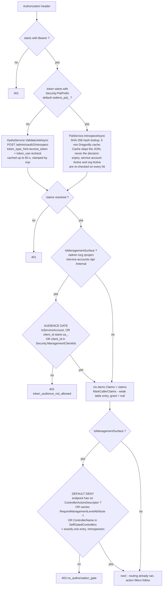
```mermaid
flowchart TD
    a["Authorization header"]
    b{"starts with Bearer ?"}
    r401a["401"]
    c{"token starts with<br/>Security:PatPrefix<br/>default rediens_pat_ ?"}
    pat["PatService.IntrospectAsync<br/>SHA-256 hash lookup, 5 min Dragonfly cache.<br/>Cache skips the JOIN, never the decision:<br/>expiry, service account Active and org Active<br/>are re-checked on every hit"]
    jwt["HydraService.ValidateJwtAsync<br/>POST /admin/oauth2/introspect<br/>token_type_hint=access_token + token_use recheck<br/>cached up to 60 s, clamped by exp"]
    d{"claims resolved ?"}
    r401b["401"]

    e{"IsManagementSurface ?<br/>/admin /org /project<br/>/service-accounts /api /internal"}
    f{"AUDIENCE GATE<br/>IsServiceAccount, OR client_id starts sa_,<br/>OR client_id in Security:ManagementClientIds"}
    r403a["403 token_audience_not_allowed"]

    g["ctx.Items Claims = claims<br/>MarkCallerClaims - weak table entry, grant = null"]

    h{"DEFAULT DENY<br/>endpoint has no ControllerActionDescriptor ?<br/>OR carries RequireManagementLevelAttribute ?<br/>OR ControllerName in SelfGatedControllers<br/>= exactly one entry, Introspection"}
    r403b["403 no_authorisation_gate"]
    nxt["next - routing already ran, action filters follow"]

    a --> b
    b -->|"no"| r401a
    b -->|"yes"| c
    c -->|"yes"| pat --> d
    c -->|"no"| jwt --> d
    d -->|"no"| r401b
    d -->|"yes"| e
    e -->|"no"| g
    e -->|"yes"| f
    f -->|"no"| r403a
    f -->|"yes"| g
    g --> hcheck{"IsManagementSurface ?"}
    hcheck -->|"no"| nxt
    hcheck -->|"yes"| h
    h -->|"no"| r403b
    h -->|"yes"| nxt
```

The `SelfGatedControllers` array is the *whole* exemption set and holds one entry. A new controller
added on any management prefix without an authorisation attribute fails closed at runtime.

### 2.3 The action filter, and where the grant appears

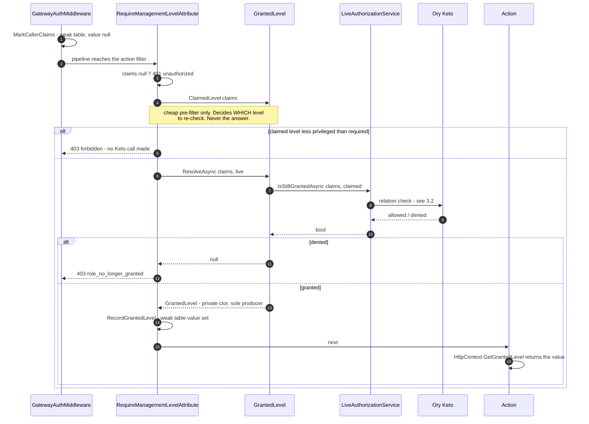
```mermaid
sequenceDiagram
    autonumber
    participant M as GatewayAuthMiddleware
    participant F as RequireManagementLevelAttribute
    participant G as GrantedLevel
    participant L as LiveAuthorizationService
    participant K as Ory Keto
    participant A as Action

    M->>M: MarkCallerClaims - weak table, value null
    M->>F: pipeline reaches the action filter
    F->>F: claims null ? 401 unauthorized
    F->>G: ClaimedLevel claims
    Note over F,G: cheap pre-filter only. Decides WHICH level<br/>to re-check. Never the answer.
    alt claimed level less privileged than required
        F-->>M: 403 forbidden - no Keto call made
    else
        F->>G: ResolveAsync claims, live
        G->>L: IsStillGrantedAsync claims, claimed
        L->>K: relation check - see 3.2
        K-->>L: allowed / denied
        L-->>G: bool
        alt denied
            G-->>F: null
            F-->>M: 403 role_no_longer_granted
        else granted
            G-->>F: GrantedLevel - private ctor, sole producer
            F->>F: RecordGrantedLevel - weak table value set
            F->>A: next
            A->>A: HttpContext.GetGrantedLevel returns the value
        end
    end
```

Before step 12 the action would read `null` from `GetGrantedLevel()`, which is the only honest
answer when no live check has run.

---

## 3. Authorisation: claim versus grant

### 3.1 Two types, one of which cannot be forged

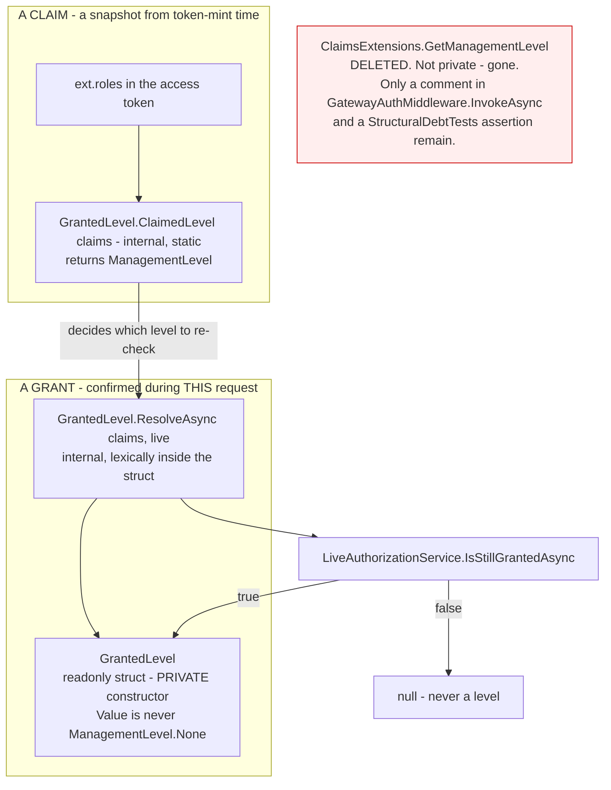
```mermaid
flowchart TB
    subgraph claimside["A CLAIM - a snapshot from token-mint time"]
        tok["ext.roles in the access token"]
        cl["GrantedLevel.ClaimedLevel claims - internal, static<br/>returns ManagementLevel"]
        tok --> cl
    end

    subgraph grantside["A GRANT - confirmed during THIS request"]
        rs["GrantedLevel.ResolveAsync claims, live<br/>internal, lexically inside the struct"]
        gl["GrantedLevel<br/>readonly struct - PRIVATE constructor<br/>Value is never ManagementLevel.None"]
        rs --> gl
    end

    cl -->|"decides which level to re-check"| rs
    live["LiveAuthorizationService.IsStillGrantedAsync"]
    rs --> live
    live -->|"true"| gl
    live -->|"false"| nul["null - never a level"]

    gone["ClaimsExtensions.GetManagementLevel<br/>DELETED. Not private - gone.<br/>Only a comment in GatewayAuthMiddleware.InvokeAsync<br/>and a StructuralDebtTests assertion remain."]

    style gone fill:#fee,stroke:#c00
```

Only **two** call sites read `ClaimedLevel`, and both are legitimately about the token rather than
about what its bearer may do:

| Call site | Why a claim is the right question |
|---|---|
| `RequireManagementLevelAttribute:31` | picks *which* level to re-check, then throws the claim away |
| `IntrospectionController:109` | introspection is asked about **somebody else's** token; the answer describes that token, and management roles are stripped from it if `IsStillGrantedAsync` says they are no longer real |

Only **three** production files read `GetGrantedLevel()`: `ServiceAccountController`,
`ProjectController`, and the accessor's own definition. Everything else gates on the attribute and
never needs the value.

⚠ A correction to a widely repeated summary: `GetManagementLevel` is **not private**. It was made
private and then deleted outright. `StructuralDebtTests.cs:42` asserts the public static overload
does not exist; its own docstring still says "is private" and is stale.

### 3.2 How the live check answers

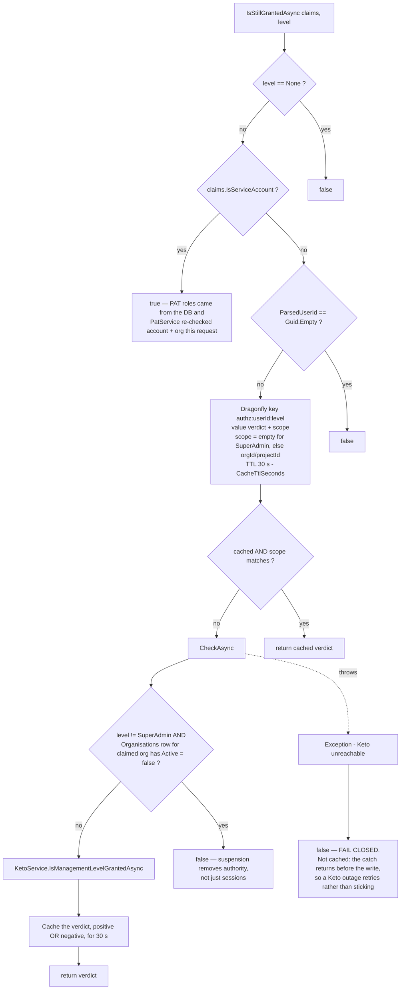
```mermaid
flowchart TD
    s["IsStillGrantedAsync claims, level"]
    n{"level == None ?"}
    sa{"claims.IsServiceAccount ?"}
    saok["true — PAT roles came from the DB and<br/>PatService re-checked account + org this request"]
    uid{"ParsedUserId == Guid.Empty ?"}
    cache["Dragonfly key authz:userId:level<br/>value verdict + scope<br/>scope = empty for SuperAdmin, else orgId/projectId<br/>TTL 30 s - CacheTtlSeconds"]
    hit{"cached AND scope matches ?"}
    chk["CheckAsync"]
    susp{"level != SuperAdmin AND<br/>Organisations row for claimed org has Active = false ?"}
    keto["KetoService.IsManagementLevelGrantedAsync"]
    err["Exception - Keto unreachable"]
    store["Cache the verdict, positive OR negative, for 30 s"]

    s --> n
    n -->|"yes"| f1["false"]
    n -->|"no"| sa
    sa -->|"yes"| saok
    sa -->|"no"| uid
    uid -->|"yes"| f2["false"]
    uid -->|"no"| cache --> hit
    hit -->|"yes"| ret["return cached verdict"]
    hit -->|"no"| chk
    chk --> susp
    susp -->|"yes"| f3["false — suspension removes authority,<br/>not just sessions"]
    susp -->|"no"| keto
    keto --> store
    chk -.->|"throws"| err --> f4["false — FAIL CLOSED.<br/>Not cached: the catch returns before the write,<br/>so a Keto outage retries rather than sticking"]
    store --> ret2["return verdict"]
```

The three tuple shapes `IsManagementLevelGrantedAsync` accepts, exactly as
`KetoService.cs:96-123` writes them:

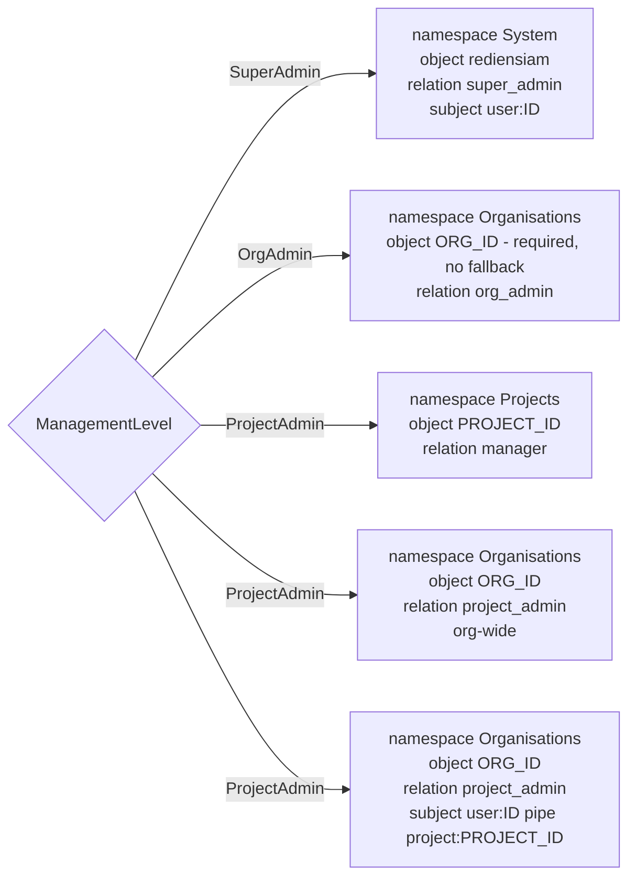
```mermaid
flowchart LR
    lvl{"ManagementLevel"}
    lvl -->|"SuperAdmin"| t1["namespace System<br/>object rediensiam<br/>relation super_admin<br/>subject user:ID"]
    lvl -->|"OrgAdmin"| t2["namespace Organisations<br/>object ORG_ID - required, no fallback<br/>relation org_admin"]
    lvl -->|"ProjectAdmin"| t3a["namespace Projects<br/>object PROJECT_ID<br/>relation manager"]
    lvl -->|"ProjectAdmin"| t3b["namespace Organisations<br/>object ORG_ID<br/>relation project_admin<br/>org-wide"]
    lvl -->|"ProjectAdmin"| t3c["namespace Organisations<br/>object ORG_ID<br/>relation project_admin<br/>subject user:ID pipe project:PROJECT_ID"]
```

`ProjectAdmin` is granted if **any** of the three holds. `OrgAdmin` requires a named org — the
"admin of any org" fallback that let an orphaned grant satisfy the check is gone, and so is the
`db.OrgRoles.AnyAsync` fallback in `LiveAuthorizationService` that answered "project_admin
*somewhere*" to the question "project_admin *here*".

**Honest limits on this diagram.** `org_roles` is still written alongside every Keto tuple. It is no
longer consulted for an authorisation *answer*, but the dual write is real — tuple first, row
second, with a compensating tuple delete in the `catch`, **no reconciler and no outbox**. A killed
process between the two writes leaves them divergent. And `AuthController.GetConsent` reads
`db.OrgRoles` to resolve the org and project scopes stamped into the minted token (§4), after the
role list itself came from Keto.

---

## 4. OIDC login

### 4.1 Password login, tenant project

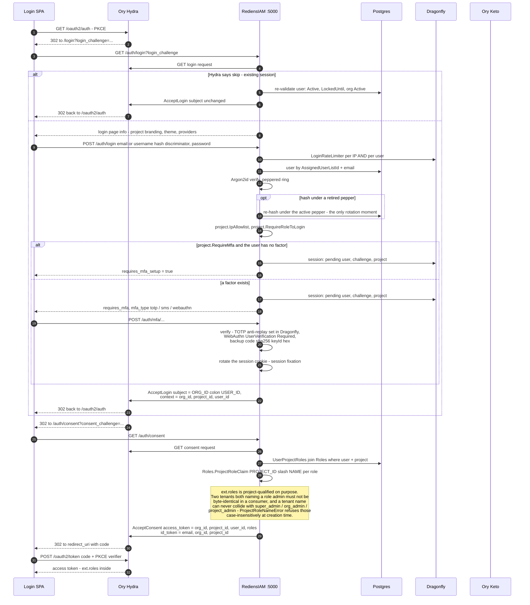
```mermaid
sequenceDiagram
    autonumber
    participant SPA as Login SPA
    participant H as Ory Hydra
    participant R as RediensIAM :5000
    participant DB as Postgres
    participant DF as Dragonfly
    participant K as Ory Keto

    SPA->>H: GET /oauth2/auth - PKCE
    H-->>SPA: 302 to /login?login_challenge=...
    SPA->>R: GET /auth/login?login_challenge
    R->>H: GET login request
    alt Hydra says skip - existing session
        R->>DB: re-validate user: Active, LockedUntil, org Active
        R->>H: AcceptLogin subject unchanged
        H-->>SPA: 302 back to /oauth2/auth
    else
        R-->>SPA: login page info - project branding, theme, providers
        SPA->>R: POST /auth/login  email or username hash discriminator, password
        R->>DF: LoginRateLimiter per IP AND per user
        R->>DB: user by AssignedUserListId + email
        R->>R: Argon2id verify, peppered ring
        opt hash under a retired pepper
            R->>DB: re-hash under the active pepper - the only rotation moment
        end
        R->>R: project.IpAllowlist, project.RequireRoleToLogin
        alt project.RequireMfa and the user has no factor
            R->>DF: session: pending user, challenge, project
            R-->>SPA: requires_mfa_setup = true
        else a factor exists
            R->>DF: session: pending user, challenge, project
            R-->>SPA: requires_mfa, mfa_type totp / sms / webauthn
            SPA->>R: POST /auth/mfa/...
            R->>R: verify - TOTP anti-replay set in Dragonfly,<br/>WebAuthn UserVerification Required,<br/>backup code sha256 keyId hex
            R->>R: rotate the session cookie - session fixation
        end
        R->>H: AcceptLogin  subject = ORG_ID colon USER_ID,<br/>context = org_id, project_id, user_id
        H-->>SPA: 302 back to /oauth2/auth
    end

    H-->>SPA: 302 to /auth/consent?consent_challenge=...
    SPA->>R: GET /auth/consent
    R->>H: GET consent request
    R->>DB: UserProjectRoles join Roles where user + project
    R->>R: Roles.ProjectRoleClaim  PROJECT_ID slash NAME  per role
    Note over R: ext.roles is project-qualified on purpose.<br/>Two tenants both naming a role admin must not be<br/>byte-identical in a consumer, and a tenant name<br/>can never collide with super_admin / org_admin /<br/>project_admin - ProjectRoleNameError refuses those<br/>case-insensitively at creation time.
    R->>H: AcceptConsent  access_token = org_id, project_id, user_id, roles<br/>id_token = email, org_id, project_id
    H-->>SPA: 302 to redirect_uri with code
    SPA->>H: POST /oauth2/token  code + PKCE verifier
    H-->>SPA: access token - ext.roles inside
```

### 4.2 Management console login — the other branch of the same consent handler

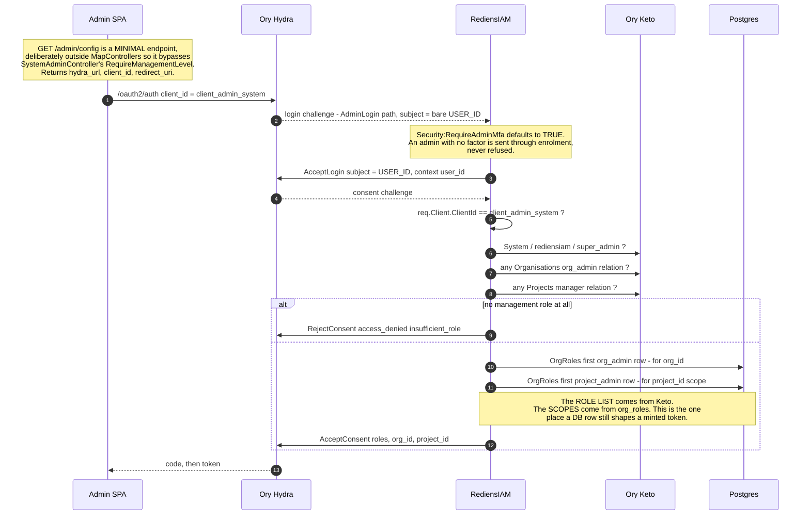
```mermaid
sequenceDiagram
    autonumber
    participant SPA as Admin SPA
    participant H as Ory Hydra
    participant R as RediensIAM
    participant K as Ory Keto
    participant DB as Postgres

    Note over SPA: GET /admin/config is a MINIMAL endpoint,<br/>deliberately outside MapControllers so it bypasses<br/>SystemAdminController's RequireManagementLevel.<br/>Returns hydra_url, client_id, redirect_uri.
    SPA->>H: /oauth2/auth  client_id = client_admin_system
    H-->>R: login challenge - AdminLogin path, subject = bare USER_ID
    Note over R: Security:RequireAdminMfa defaults to TRUE.<br/>An admin with no factor is sent through enrolment,<br/>never refused.
    R->>H: AcceptLogin subject = USER_ID, context user_id
    H-->>R: consent challenge
    R->>R: req.Client.ClientId == client_admin_system ?
    R->>K: System / rediensiam / super_admin ?
    R->>K: any Organisations org_admin relation ?
    R->>K: any Projects manager relation ?
    alt no management role at all
        R->>H: RejectConsent access_denied insufficient_role
    else
        R->>DB: OrgRoles first org_admin row - for org_id
        R->>DB: OrgRoles first project_admin row - for project_id scope
        Note over R,DB: The ROLE LIST comes from Keto.<br/>The SCOPES come from org_roles. This is the one<br/>place a DB row still shapes a minted token.
        R->>H: AcceptConsent  roles, org_id, project_id
    end
    H-->>SPA: code, then token
```

`App__AdminSpaOrigin` and the Hydra `redirect_uri` must match the SPA's browser origin, or the
authorize step fails before any of this runs.

### 4.3 The federated entry points

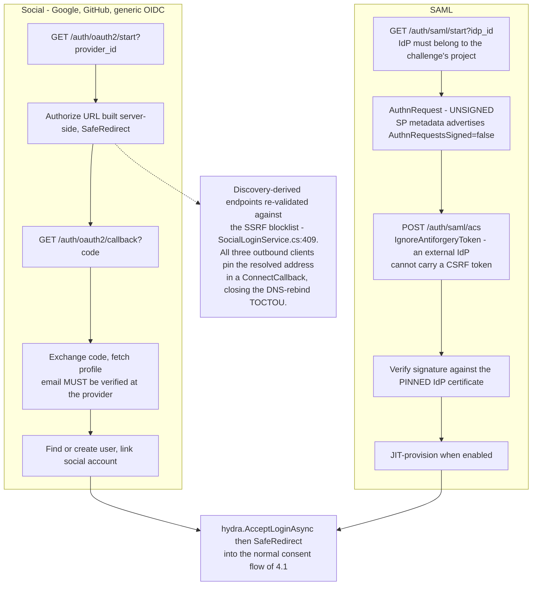
```mermaid
flowchart TD
    subgraph social["Social - Google, GitHub, generic OIDC"]
        s1["GET /auth/oauth2/start?provider_id"]
        s2["Authorize URL built server-side, SafeRedirect"]
        s3["GET /auth/oauth2/callback?code"]
        s4["Exchange code, fetch profile<br/>email MUST be verified at the provider"]
        s5["Find or create user, link social account"]
        s1-->s2-->s3-->s4-->s5
    end
    subgraph saml["SAML"]
        m1["GET /auth/saml/start?idp_id<br/>IdP must belong to the challenge's project"]
        m2["AuthnRequest - UNSIGNED<br/>SP metadata advertises AuthnRequestsSigned=false"]
        m3["POST /auth/saml/acs<br/>IgnoreAntiforgeryToken - an external IdP<br/>cannot carry a CSRF token"]
        m4["Verify signature against the PINNED IdP certificate"]
        m5["JIT-provision when enabled"]
        m1-->m2-->m3-->m4-->m5
    end
    join["hydra.AcceptLoginAsync then SafeRedirect<br/>into the normal consent flow of 4.1"]
    s5-->join
    m5-->join

    ssrf["Discovery-derived endpoints re-validated against<br/>the SSRF blocklist - SocialLoginService.cs:409.<br/>All three outbound clients pin the resolved address<br/>in a ConnectCallback, closing the DNS-rebind TOCTOU."]
    s2-.->ssrf
```

---

## 5. Introspection and authorize

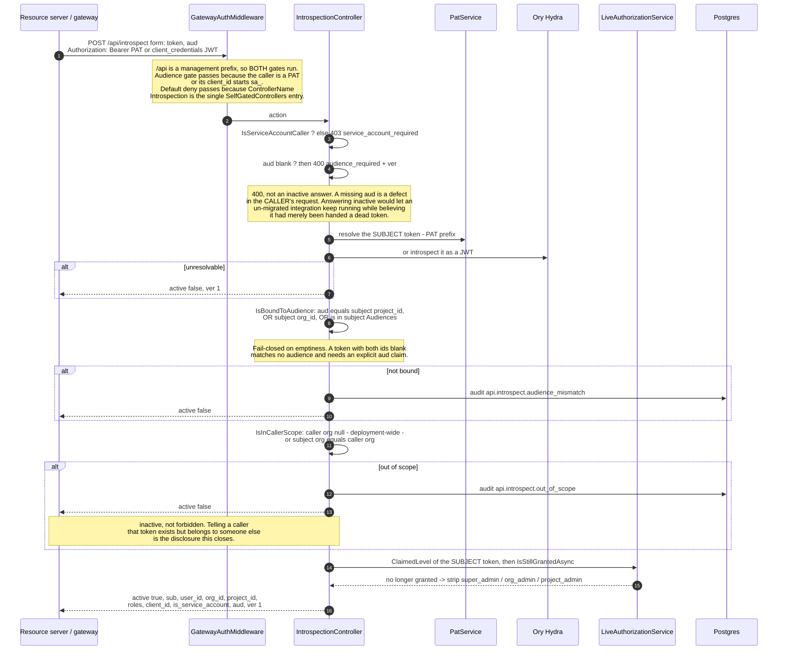
```mermaid
sequenceDiagram
    autonumber
    participant RS as Resource server / gateway
    participant GW as GatewayAuthMiddleware
    participant IC as IntrospectionController
    participant P as PatService
    participant H as Ory Hydra
    participant L as LiveAuthorizationService
    participant DB as Postgres

    RS->>GW: POST /api/introspect  form: token, aud<br/>Authorization: Bearer PAT or client_credentials JWT
    Note over GW: /api is a management prefix, so BOTH gates run.<br/>Audience gate passes because the caller is a PAT<br/>or its client_id starts sa_.<br/>Default deny passes because ControllerName<br/>Introspection is the single SelfGatedControllers entry.
    GW->>IC: action
    IC->>IC: IsServiceAccountCaller ? else 403 service_account_required
    IC->>IC: aud blank ? then 400 audience_required + ver
    Note over IC: 400, not an inactive answer. A missing aud is a defect<br/>in the CALLER's request. Answering inactive would let an<br/>un-migrated integration keep running while believing<br/>it had merely been handed a dead token.
    IC->>P: resolve the SUBJECT token - PAT prefix
    IC->>H: or introspect it as a JWT
    alt unresolvable
        IC-->>RS: active false, ver 1
    end
    IC->>IC: IsBoundToAudience: aud equals subject project_id,<br/>OR subject org_id, OR is in subject Audiences
    Note over IC: Fail-closed on emptiness. A token with both ids blank<br/>matches no audience and needs an explicit aud claim.
    alt not bound
        IC->>DB: audit api.introspect.audience_mismatch
        IC-->>RS: active false
    end
    IC->>IC: IsInCallerScope: caller org null - deployment-wide -<br/>or subject org equals caller org
    alt out of scope
        IC->>DB: audit api.introspect.out_of_scope
        IC-->>RS: active false
        Note over IC,RS: inactive, not forbidden. Telling a caller<br/>that token exists but belongs to someone else<br/>is the disclosure this closes.
    end
    IC->>L: ClaimedLevel of the SUBJECT token, then IsStillGrantedAsync
    L-->>IC: no longer granted -> strip super_admin / org_admin / project_admin
    IC-->>RS: active true, sub, user_id, org_id, project_id,<br/>roles, client_id, is_service_account, aud, ver 1
```

### 5.1 `/api/authorize` — the extra guards

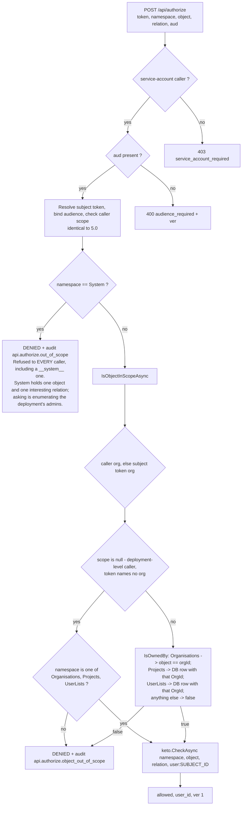
```mermaid
flowchart TD
    a["POST /api/authorize<br/>token, namespace, object, relation, aud"]
    b{"service-account caller ?"}
    c{"aud present ?"}
    d["Resolve subject token, bind audience, check caller scope<br/>identical to 5.0"]
    e{"namespace == System ?"}
    f["DENIED + audit api.authorize.out_of_scope<br/>Refused to EVERY caller, including a __system__ one.<br/>System holds one object and one interesting relation;<br/>asking is enumerating the deployment's admins."]
    g["IsObjectInScopeAsync"]
    h{"caller org, else subject token org"}
    i{"scope is null - deployment-level caller,<br/>token names no org"}
    j{"namespace is one of<br/>Organisations, Projects, UserLists ?"}
    k["DENIED + audit api.authorize.object_out_of_scope"]
    l["IsOwnedBy: Organisations -> object == orgId;<br/>Projects -> DB row with that OrgId;<br/>UserLists -> DB row with that OrgId;<br/>anything else -> false"]
    m["keto.CheckAsync namespace, object, relation, user:SUBJECT_ID"]
    n["allowed, user_id, ver 1"]

    a-->b
    b-->|"no"| x1["403 service_account_required"]
    b-->|"yes"| c
    c-->|"no"| x2["400 audience_required + ver"]
    c-->|"yes"| d --> e
    e-->|"yes"| f
    e-->|"no"| g --> h --> i
    i-->|"yes"| j
    j-->|"no"| k
    j-->|"yes"| m
    i-->|"no"| l
    l-->|"false"| k
    l-->|"true"| m
    m --> n
```

### 5.2 The `ver` contract

`ContractVersion = 1` rides on **every** answer, including `{"active": false}` and both 400s. It
exists so a client can tell an audience-enforcing server from one that silently drops the `aud`
field it was sent: an older RediensIAM answers without `ver`, so an SDK requiring `ver >= 1` fails
closed rather than believing it is bound when it is not.

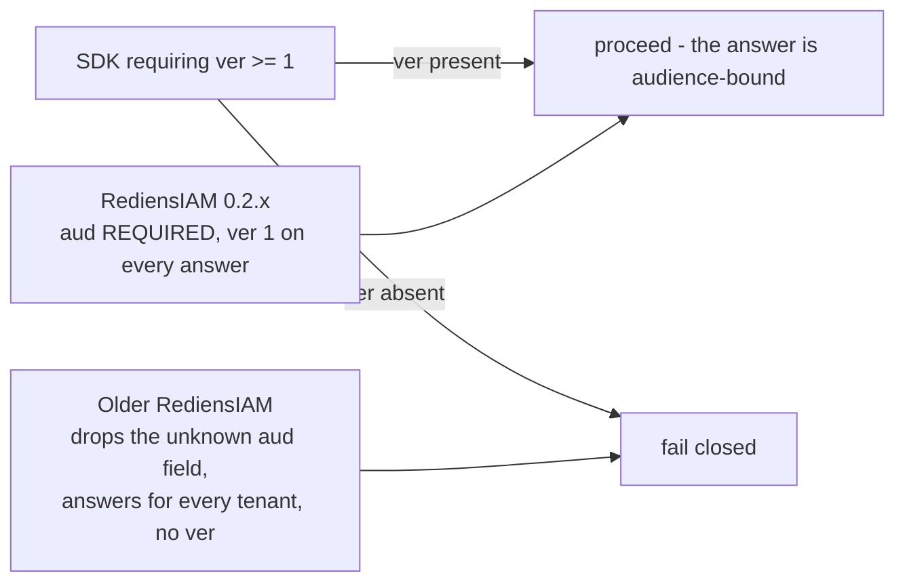
```mermaid
flowchart LR
    sdk["SDK requiring ver >= 1"]
    new["RediensIAM 0.2.x<br/>aud REQUIRED, ver 1 on every answer"]
    old["Older RediensIAM<br/>drops the unknown aud field,<br/>answers for every tenant, no ver"]
    sdk -->|"ver present"| ok["proceed - the answer is audience-bound"]
    sdk -->|"ver absent"| fail["fail closed"]
    new --> ok
    old --> fail
```

---

## 6. Data model and tenancy

`Organisation` is the tenant root. Every RLS predicate in `deploy/rediensiam/files/rls.sql` is
either `OrgId = rls_org()` directly or an `EXISTS` walk back to one along the edges drawn here.

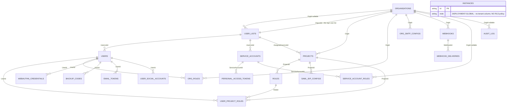
```mermaid
erDiagram
    ORGANISATIONS ||--o{ USER_LISTS : "OrgId nullable"
    ORGANISATIONS ||--|| USER_LISTS : "OrgListId - the org's own list"
    ORGANISATIONS ||--o{ PROJECTS : "OrgId"
    ORGANISATIONS ||--o{ ORG_ROLES : "OrgId"
    ORGANISATIONS ||--o{ ORG_SMTP_CONFIGS : "OrgId"
    ORGANISATIONS ||--o{ WEBHOOKS : "OrgId"
    ORGANISATIONS ||--o{ SERVICE_ACCOUNT_ROLES : "OrgId nullable"
    ORGANISATIONS ||--o{ AUDIT_LOG : "OrgId nullable"

    USER_LISTS ||--o{ USERS : "UserListId"
    USER_LISTS ||--o{ SERVICE_ACCOUNTS : "UserListId"
    USER_LISTS ||--o{ PROJECTS : "AssignedUserListId"

    PROJECTS ||--o{ ROLES : "ProjectId"
    PROJECTS ||--o{ SAML_IDP_CONFIGS : "ProjectId"
    PROJECTS ||--o{ USER_PROJECT_ROLES : "ProjectId"

    USERS ||--o{ USER_PROJECT_ROLES : "UserId"
    USERS ||--o{ ORG_ROLES : "UserId"
    USERS ||--o{ WEBAUTHN_CREDENTIALS : "UserId"
    USERS ||--o{ BACKUP_CODES : "UserId"
    USERS ||--o{ EMAIL_TOKENS : "UserId"
    USERS ||--o{ USER_SOCIAL_ACCOUNTS : "UserId"

    ROLES ||--o{ USER_PROJECT_ROLES : "RoleId"

    SERVICE_ACCOUNTS ||--o{ PERSONAL_ACCESS_TOKENS : "ServiceAccountId"
    SERVICE_ACCOUNTS ||--o{ SERVICE_ACCOUNT_ROLES : "ServiceAccountId"

    WEBHOOKS ||--o{ WEBHOOK_DELIVERIES : "WebhookId"

    INSTANCES {
        string Id PK
        string note "DEPLOYMENT-GLOBAL - no tenant column, NO RLS policy"
    }
```

### 6.1 Which tables carry an RLS policy

19 tables get `ENABLE` + `FORCE ROW LEVEL SECURITY` and one `rediensiam_tenant` policy each.

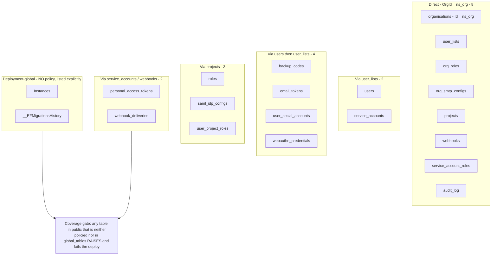
```mermaid
flowchart TB
    subgraph direct["Direct - OrgId = rls_org - 8"]
        d1["organisations - Id = rls_org"]
        d2["user_lists"]
        d3["org_roles"]
        d4["org_smtp_configs"]
        d5["projects"]
        d6["webhooks"]
        d7["service_account_roles"]
        d8["audit_log"]
    end
    subgraph vialist["Via user_lists - 2"]
        u1["users"]
        u2["service_accounts"]
    end
    subgraph viauser["Via users then user_lists - 4"]
        c1["backup_codes"]
        c2["email_tokens"]
        c3["user_social_accounts"]
        c4["webauthn_credentials"]
    end
    subgraph viaproj["Via projects - 3"]
        p1["roles"]
        p2["saml_idp_configs"]
        p3["user_project_roles"]
    end
    subgraph viaother["Via service_accounts / webhooks - 2"]
        o1["personal_access_tokens"]
        o2["webhook_deliveries"]
    end
    subgraph global["Deployment-global - NO policy, listed explicitly"]
        g1["Instances"]
        g2["__EFMigrationsHistory"]
    end
    gate["Coverage gate: any table in public that is neither<br/>policied nor in global_tables RAISES and fails the deploy"]
    global --> gate
    viaother --> gate
```

### 6.2 How a scope reaches the database

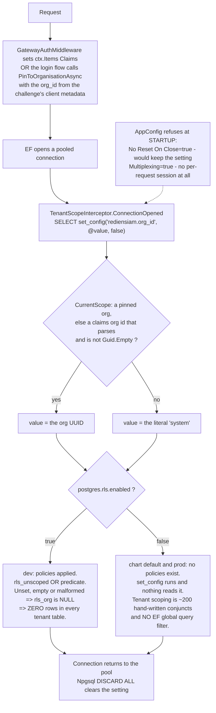
```mermaid
flowchart TD
    req["Request"]
    mw["GatewayAuthMiddleware sets ctx.Items Claims<br/>OR the login flow calls PinToOrganisationAsync<br/>with the org_id from the challenge's client metadata"]
    open["EF opens a pooled connection"]
    int["TenantScopeInterceptor.ConnectionOpened<br/>SELECT set_config('rediensiam.org_id', @value, false)"]
    val{"CurrentScope: a pinned org,<br/>else a claims org id that parses<br/>and is not Guid.Empty ?"}
    org["value = the org UUID"]
    sys["value = the literal 'system'"]
    pol{"postgres.rls.enabled ?"}
    on["dev: policies applied.<br/>rls_unscoped OR predicate.<br/>Unset, empty or malformed => rls_org is NULL<br/>=> ZERO rows in every tenant table."]
    off["chart default and prod: no policies exist.<br/>set_config runs and nothing reads it.<br/>Tenant scoping is ~200 hand-written conjuncts<br/>and NO EF global query filter."]
    ret["Connection returns to the pool<br/>Npgsql DISCARD ALL clears the setting"]
    guard["AppConfig refuses at STARTUP:<br/>No Reset On Close=true - would keep the setting<br/>Multiplexing=true - no per-request session at all"]

    req-->mw-->open-->int-->val
    val-->|"yes"| org
    val-->|"no"| sys
    org-->pol
    sys-->pol
    pol-->|"true"| on
    pol-->|"false"| off
    on-->ret
    off-->ret
    guard-.->int
```

Twelve code paths run as `'system'` on purpose, enumerated in
`TenantScopeInterceptor.LegitimatelyUnscopedPaths`: `AuthController.AdminLogin`, the consent
handler's admin-client branch, the four token-keyed endpoints, the fallback `projects` read, PAT
introspection in `GatewayAuthMiddleware`, `SamlController`, EF migrations, the super-admin
bootstrap, the instance-config provider, the audit retention sweep, the webhook dispatcher, and
`SystemAdminController`.

**The rest of the login path is no longer among them.** It used to be — a login resolved a user by
e-mail before any tenant was known. It now pins the organisation first, from the `org_id` in the
login challenge's OAuth2 client metadata, usually with no database read at all. Password login,
registration, consent, every MFA step and the social flows run under the tenant's own scope. What
still cannot be scoped is the admin console (its users have `OrgId IS NULL`) and the token-keyed
endpoints (their subject is a random token) — and `SamlController`, which could be pinned and is
not. See [`SECURITY.md`](SECURITY.md#what-is-scoped-and-what-still-is-not).

⚠ RLS is still a schema-level backstop under the hand-written conjuncts, not a replacement for
them.

---

## 7. Encryption and key material

### 7.1 One root, six purposes

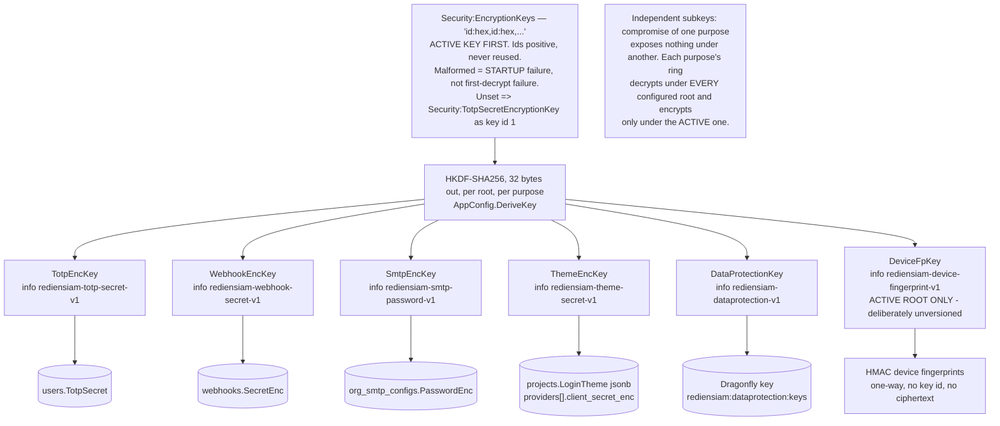
```mermaid
flowchart TB
    ring["Security:EncryptionKeys — 'id:hex,id:hex,...'<br/>ACTIVE KEY FIRST. Ids positive, never reused.<br/>Malformed = STARTUP failure, not first-decrypt failure.<br/>Unset => Security:TotpSecretEncryptionKey as key id 1"]
    hkdf["HKDF-SHA256, 32 bytes out, per root, per purpose<br/>AppConfig.DeriveKey"]
    ring --> hkdf

    hkdf --> k1["TotpEncKey<br/>info rediensiam-totp-secret-v1"]
    hkdf --> k2["WebhookEncKey<br/>info rediensiam-webhook-secret-v1"]
    hkdf --> k3["SmtpEncKey<br/>info rediensiam-smtp-password-v1"]
    hkdf --> k4["ThemeEncKey<br/>info rediensiam-theme-secret-v1"]
    hkdf --> k5["DataProtectionKey<br/>info rediensiam-dataprotection-v1"]
    hkdf --> k6["DeviceFpKey<br/>info rediensiam-device-fingerprint-v1<br/>ACTIVE ROOT ONLY - deliberately unversioned"]

    k1 --> p1[("users.TotpSecret")]
    k2 --> p2[("webhooks.SecretEnc")]
    k3 --> p3[("org_smtp_configs.PasswordEnc")]
    k4 --> p4[("projects.LoginTheme jsonb<br/>providers[].client_secret_enc")]
    k5 --> p5[("Dragonfly key<br/>rediensiam:dataprotection:keys")]
    k6 --> p6["HMAC device fingerprints<br/>one-way, no key id, no ciphertext"]

    sep["Independent subkeys: compromise of one purpose<br/>exposes nothing under another. Each purpose's ring<br/>decrypts under EVERY configured root and encrypts<br/>only under the ACTIVE one."]
```

Separate ring, same shape: **`Security:Argon2Peppers`** (`id:hex,...`, active first) is HMAC-mixed
into the Argon2 input and is *not* HKDF-derived from the encryption root.

### 7.2 The ciphertext envelope

```mermaid
flowchart LR
    pt["plaintext bytes"]
    gcm["AES-GCM, 12-byte nonce, 16-byte tag<br/>key = ring.ActiveKey"]
    b64["Base64 of  nonce 12  ‖  tag 16  ‖  ciphertext"]
    pre{"ActiveId == 1 ?"}
    leg["NO PREFIX AT ALL<br/>LegacyKeyId. A deployment that never rotated<br/>produces byte-identical output to the pre-rotation build."]
    new["prefix  k  ID  colon"]
    out["stored value"]
    pt-->gcm-->b64-->pre
    pre-->|"yes"| leg-->out
    pre-->|"no"| new-->out

    parse["ParseEnvelope on read:<br/>k + digits + colon, id > 0  =>  that id<br/>anything else  =>  key id 1.<br/>Safe because the Base64 alphabet contains no colon."]
    out-.->parse
    miss["KeyFor: id not configured =>  CryptographicException NAMING the id.<br/>Loud, because the alternative looks like a corrupt secret."]
    parse-.->miss
```

Password hashes carry the same idea in the PHC string instead: a `$k=<id>` suffix, with pepper id 1
and "no pepper" writing no marker. Backup codes use `sha256:{keyId}:{hex}`.

### 7.3 Rotation — how a value moves between keys

```mermaid
sequenceDiagram
    autonumber
    participant Op as Operator
    participant Cfg as Security:EncryptionKeys
    participant Pods as Every replica
    participant EP as GET/POST /admin/key-rotation
    participant DB as Postgres

    Op->>Cfg: PREPEND the new key: '2:new,1:old'
    Op->>Pods: roll out - ALL replicas must hold BOTH keys
    Note over Pods: New writes are already under key 2.<br/>Old values still read fine under key 1.
    Op->>EP: GET /admin/key-rotation
    EP->>DB: count rows whose envelope id != active, over 4 columns
    EP-->>Op: activeKeyId, configuredIds, per-column pending, totalPending
    loop until totalPending == 0
        Op->>EP: POST /admin/key-rotation/reencrypt
        EP->>DB: batches of 500 - decrypt under the named id,<br/>re-encrypt under the active id
        Note over EP,DB: No resume cursor. Each batch commits before<br/>the next is read, so an interruption is fixed by<br/>re-running: it re-selects whatever is still pending.
        EP-->>Op: status
    end
    Note over Op: totalPending == 0 is the ONLY signal that the<br/>retired key may safely be dropped.
    Op->>Cfg: drop the old entry
```

The four columns the sweep covers: `User.TotpSecret`, `Webhook.SecretEnc`,
`OrgSmtpConfig.PasswordEnc`, `Project.LoginTheme`.

What the sweep **cannot** cover, and why:

| Material | Why not | What actually finishes the rotation |
|---|---|---|
| Argon2 pepper | the plaintext password exists only at verify time | `NeedsRepepper` after every successful login re-derives the hash. Dormant accounts keep the old pepper indefinitely — finishing is a policy decision about them, not a job that completes |
| Device fingerprint key | one-way HMAC, no key id in the value | follows the active root only; retiring a root invalidates known-device state, which is the safe direction |
| Hydra system secret | **no rotation code exists in `src/`** — runbook only | prepend-never-replace in Hydra's `secrets.system` list, keep the old entry for at least the refresh-token TTL |
| DataProtection key ring | covered for free — same envelope | root rotation re-wraps it on next write |

### 7.4 The DataProtection key ring, read side

```mermaid
flowchart TD
    boot["Startup: AddDataProtection<br/>PersistKeysToStackExchangeRedis rediensiam:dataprotection:keys<br/>ProtectKeysWithRootKey - EncryptedOnlyXmlRepository"]
    read["GetAllElements"]
    chk{"every key element wrapped in the k-id envelope ?"}
    ok["Unwrap under DataProtectionKey, use for session cookies"]
    boom["THROW at startup, naming the fix:<br/>DEL rediensiam:dataprotection:keys<br/>one-time session loss"]
    why["An attacker with WRITE access to the cache could<br/>otherwise append a PLAINTEXT key that DataProtection<br/>would adopt and use to mint session cookies.<br/>Refusing is the correct trade."]
    boot-->read-->chk
    chk-->|"yes"| ok
    chk-->|"no"| boom
    boom-.->why
    ind["Deliberately INDEPENDENT of cache TLS:<br/>TLS protects the wire, this protects the stored bytes."]
```

---

## 8. Audit trail

### 8.1 Where rows come from

```mermaid
flowchart TD
    subgraph producers["Two producers, deliberately both"]
        manual["99 hand-written audit.RecordAsync call sites<br/>Carry INTENT: 'this was a role revocation'.<br/>Names like user.login.failure, api.introspect.out_of_scope"]
        auto["RecordUnloggedSecurityMutationsAsync<br/>The FLOOR beneath them. Names all start entity.*<br/>so a query can tell the two apart."]
    end

    save["RediensIamDbContext.SaveChangesAsync"]
    manual --> save
    auto --> save

    subgraph hook["Every save, in this order"]
        s1["1. RejectAuditLogTampering<br/>throws if any tracked AuditLog is Modified or Deleted.<br/>APPLICATION LAYER ONLY."]
        s2["2. RecordUnloggedSecurityMutationsAsync"]
        s3["3. ChainAsync pending - inside a transaction it opens if none exists"]
        s1-->s2-->s3
    end
    save --> hook

    subgraph what["What step 2 watches"]
        w1["User Modified, any of:<br/>PasswordHash TotpSecret TotpEnabled WebAuthnEnabled<br/>Phone PhoneVerified Email EmailVerified Active<br/>=> entity.users.credential_changed + the column names"]
        w2["Any state change on BackupCode, WebAuthnCredential,<br/>UserSocialAccount, SamlIdpConfig, Instance<br/>=> entity.TABLE.inserted / updated / deleted"]
        w3["OrgId back-filled from the subject user's user_list,<br/>so the row lands on the TENANT's chain and is visible<br/>at /org/audit-log - the whole point of T-N2"]
    end
    s2 --> what
```

### 8.2 The per-organisation hash chain

```mermaid
flowchart LR
    grp["Group pending rows by OrgId"]
    lock["pg_advisory_xact_lock per org<br/>taken in FIXED KEY ORDER so two transactions<br/>touching the same pair cannot deadlock"]
    prev["Read the last Hash for that OrgId - ORDER BY Id DESC"]
    comp["AuditChain.Compute<br/>SHA-256 over a 0x1E-separated canonical string:<br/>prevHash, OrgId, ProjectId, UserId, ActorId, Action,<br/>TargetType, TargetId, IpAddress, UserAgent,<br/>CreatedAt normalised to microseconds,<br/>then metadata keys sorted ordinal, 0x1F-separated"]
    link["row.PrevHash = prev ; row.Hash = computed ; prev = row.Hash"]
    grp-->lock-->prev-->comp-->link

    why["PER ORGANISATION because retention purges are per organisation.<br/>A purge shortens one org's chain from the FRONT and leaves the<br/>rest verifiable; a global chain would be left with holes<br/>indistinguishable from tampering."]
    grp-.->why
```

### 8.3 What `VerifyChainAsync` checks — and who calls it

```mermaid
flowchart TD
    v["AuditLogService.VerifyChainAsync orgId"]
    load["Load every row for that OrgId, ORDER BY Id"]
    skip["SkipWhile Hash is empty<br/>pre-chain rows are UNVERIFIABLE, which is not<br/>the same as TAMPERED WITH"]
    first["First surviving row: its own PrevHash is NOT checked<br/>a retention purge legitimately removed what came before"]
    loop{"for each row"}
    c1{"i > 0 and row.PrevHash != previous row's Hash ?"}
    c2{"row.Hash != Compute row, row.PrevHash ?"}
    brk["return that row's Id - the FIRST break"]
    okr["return null - every surviving row is exactly as written<br/>and none was removed from the middle"]

    v-->load-->skip-->first-->loop
    loop-->c1
    c1-->|"yes"| brk
    c1-->|"no"| c2
    c2-->|"yes"| brk
    c2-->|"no"| loop
    loop-->|"exhausted"| okr

    caller["PRODUCTION CALLERS: NONE.<br/>No endpoint, no hosted service, no schedule.<br/>Only StructuralDebtTests calls it.<br/>It exists, it is tested, nothing runs it for you."]
    v-.->caller
    style caller fill:#fee,stroke:#c00
```

### 8.4 The three limits of the audit trail

```mermaid
flowchart TB
    l1["1. The hash is PLAIN UNKEYED SHA-256, not an HMAC.<br/>It detects accidental corruption and a careless edit.<br/>It does not stop anyone who can WRITE to the table<br/>from recomputing the whole chain."]
    l2["2. No database-level append-only enforcement.<br/>The app role must KEEP DELETE on audit_log because<br/>AuditLogRetentionService uses ExecuteDeleteAsync,<br/>which bypasses the change tracker and therefore<br/>bypasses RejectAuditLogTampering entirely."]
    l3["3. VerifyChainAsync has no production caller.<br/>Tamper-evidence you never look at is not evidence."]
```

Retention is clamped to 90–3650 days (`AppConfig.MinAuditRetentionDays`) precisely because a
retention value at or below zero is not a setting — it is a self-service purge of the evidence,
including the record of the change that purged it.

---

## What is deliberately not drawn here

- **The route table.** 184 routes do not fit in a diagram; [`API.md`](API.md) has them with their
  required authority and where each is reachable.
- **Webhook delivery.** It has its own queue, SSRF re-validation on every delivery, and a retry
  ladder; it is a subsystem, not part of the authorisation spine.
- **The `instances` configuration table's precedence rules.** They are a three-row table in
  [`ARCHITECTURE.md`](ARCHITECTURE.md#configuration-model--zitadel-style), which is clearer than a
  flowchart.
- **Anything under `~/Desktop/rediensiam-audit-perime/`.** Five reports were moved out of
  `.security-hardening/` because they assert things that are no longer true. None of them informed
  a diagram here.
